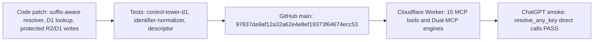
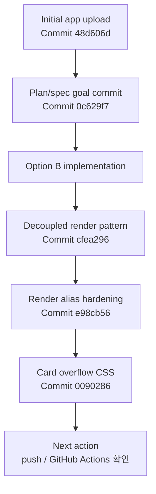

# CHANGELOG

이 문서는 현재 저장소 상태와 확인된 Git 이력을 기준으로 작성한다.

## Unreleased - 2026-05-14 Dual-MCP main, Cloudflare, and root documentation synchronization

### Addendum - 2026-05-14 current main and ChatGPT operations smoke

- Preserved the earlier `15472eac` Worker deployment and 150-test record below as a historical snapshot, then added this current operating note for local/origin `main` HEAD `97837da9af12a32a62e4e8ef19373f64674ecc53`.
- Confirmed the latest operational scope: suffix-aware HVDC code resolver, D1 Control Tower lookup, 15 MCP tools, protected R2/D1 upload and write paths, and Dual-MCP engines.
- Code evidence for this operating state is concentrated in `server/src/identifier-normalizer.ts`, `server/src/worker.ts`, and `server/src/hvdc-server.ts`.
- Test evidence for this operating state is tracked by `tests/control-tower-d1.test.ts`, `tests/identifier-normalizer.test.ts`, and `tests/descriptor.test.ts`.
- ChatGPT operations smoke confirmed direct `resolve_any_key` calls for suffixed and abbreviated HVDC codes:
  `SIM5-2A` -> `HVDC-ADOPT-SIM-0005-2A`,
  `HE68-1` -> `HVDC-ADOPT-HE-0068-1`,
  `SEI17-03` -> `HVDC-ADOPT-SEI-0017-03`.

### Changed

- Updated the root README with a 2026-05-14 operating snapshot that separates Cloudflare Workers MCP production behavior from local Python/Fuseki reference work.
- Updated SYSTEM_ARCHITECTURE with the current Cloudflare Worker, R2, D1, OAuth protected-tool, Dual-MCP engine, and 150-test verification boundary.
- Updated LAYOUT with the 15-tool runtime layout, Dual-MCP module files, 150-test baseline, and current D1 migration boundary.
- Documented the four new Dual-MCP tools: `check_cost_guard`, `check_mosb_gate`, `check_doc_guardian`, and `get_team_actions`.
- Kept `ontology-insight-upgrade/` classified as a local reference implementation and planning source, not as proof of deployed Fuseki bridge or `invoice_risk_scan` production behavior.

### Verified

- `Invoke-RestMethod https://hvdc-ontology-chatgpt-app.mscho715.workers.dev/healthz` returned Cloudflare Workers runtime, R2 enabled, D1 audit enabled, protected write tools enabled, and token configured.
- Remote MCP `initialize` and `tools/list` returned 15 tools.
- Remote MCP `check_cost_guard` smoke returned `overallBand=WARN` for a 3.00% invoice total delta.
- ChatGPT connector direct `resolve_any_key` smoke passed for suffixed / abbreviated HVDC codes:
  `SIM5-2A` → `HVDC-ADOPT-SIM-0005-2A`,
  `HE68-1` → `HVDC-ADOPT-HE-0068-1`,
  `SEI17-03` → `HVDC-ADOPT-SEI-0017-03`.
- `npm run worker:deploy` passed `npm run verify` with 10 test files and 150 tests, completed Worker dry-run, and deployed Cloudflare Worker Version ID `15472eac-2698-4d9f-94e9-a7fa344f1fd8`.
- Remote D1 migration `0003_dual_mcp_tables.sql` was applied and created `identifier_index`, `milestone_event`, and `team_role_matrix`; `team_role_matrix` contains 6 seed rows.
- `git rev-parse HEAD` and `git ls-remote origin refs/heads/main` matched `44d6c68bcd1821f2c59e325816d95793cc12d33e` before this documentation patch.

### Risks

- `20260514_project-upgrade-report.md` and `20260514_plan-doc.md` are planning inputs only until converted into root GSD `.planning/phases/*` plans.
- `invoice_risk_scan`, Cloudflare Tunnel to Fuseki, and `/mcp/staging` canary are planned work, not deployed runtime behavior.

## Unreleased - 2026-05-13 FMC role evidence corpus

### Added

- Added `data/corpus/HVDC_FMC_Role_Analysis_FINAL_10x_2026-04-27.combined.md` as a searchable FMC role evidence source.
- Added FMC role routing for person, owner, ActorRole, escalation, role-boundary, and milestone-owner questions.
- Added `tests/fmc-role-corpus.test.ts` and golden prompts for `Arvin FANR BOE 담당 업무` and `M115 담당자 누구야?`.

### Changed

- Updated corpus search so required documents keep at least one eligible evidence chunk in the returned topK set.
- Registered the FMC role corpus in `data/index/source_role_map.json`.
- Updated README, architecture, layout, and QA docs to include the new role evidence corpus.

### Verified

- Focused check: `npx vitest run tests/fmc-role-corpus.test.ts tests/evals.test.ts`.
- Result: 2 test files passed, 22 tests passed.

## Unreleased - 2026-05-13 Protected OAuth upload/write tools

### Added

- Added OAuth Bearer protected MCP tools: `create_upload_url`, `complete_upload`, `attach_uploaded_file`, `write_file_dry_run`, and `write_file_commit`.
- Added Cloudflare R2/D1 storage adapter for short-lived upload URLs, uploaded file metadata, attachment metadata, write proposals, and managed-file commits.
- Added OAuth protected resource metadata endpoints at `/.well-known/oauth-protected-resource` and `/.well-known/oauth-protected-resource/mcp`.
- Added D1 migration `migrations/0002_mcp_upload_write.sql` for upload tokens, uploaded files, file attachments, and write proposals.
- Added regression coverage in `tests/write-upload-tools.test.ts`.

### Changed

- Expanded ChatGPT and Claude submission metadata from 6 to 11 runtime tools.
- Marked upload/write tools as non-read-only and Human-gate guarded in descriptor metadata.
- Kept local Claude fallback read-safe by returning `AUTH_REQUIRED` for protected upload/write tools.

### Verified

- Focused check: `npm test -- tests/write-upload-tools.test.ts tests/descriptor.test.ts tests/claude-descriptor.test.ts`.
- Result: 3 test files passed, 43 tests passed.
- Full check: `npm run verify`.
- Result: TypeScript typecheck passed, Vitest 8 files / 113 tests passed, and `wrangler deploy --dry-run` passed.

### Risks

- A production `MCP_AUTH_TOKEN` secret must be configured before protected upload/write tools can be used successfully.
- Full external OAuth authorization-server issuance and consent UX are separate from this resource-server gate.
- Protected tools write only to Cloudflare R2/D1 managed storage and do not write back to ERP, WMS, ATLP, Foundry, email, or messaging systems.

## Unreleased - 2026-05-13 Cloudflare Workers MCP migration and deployment

### Added

- Added `server/src/worker.ts` as the Cloudflare Workers MCP entrypoint using `agents/mcp` `createMcpHandler`.
- Added `server/src/hvdc-server.ts` as the shared ChatGPT MCP tool/resource factory.
- Added generated Worker asset modules under `server/src/generated/` for corpus, sample shipment data, and widget HTML.
- Added `scripts/generate_worker_assets.py` to rebuild Worker bundle data from approved local sources.
- Added `wrangler.toml` with Cloudflare Workers, R2, and D1 bindings.
- Added D1 audit table migration at `migrations/0001_mcp_audit_logs.sql`.

### Changed

- Switched the primary ChatGPT MCP runtime from the former Node deployment target to Cloudflare Workers.
- Changed `npm run dev` and `npm run start` to run Wrangler Worker dev.
- Kept `server/src/index.ts` as a Node fallback behind `npm run node:dev`.
- Changed audit handling so Cloudflare runtime writes hash-only rows to D1 `mcp_audit_logs`; Node fallback still writes `out/audit.jsonl`.
- Removed former deployment files that are no longer used by the Cloudflare path.

### Verified

- Full check: `npm run verify`.
- Result: TypeScript typecheck passed, Vitest 7 files / 110 tests passed, and `wrangler deploy --dry-run` passed.
- Cloudflare deploy completed for `hvdc-ontology-chatgpt-app.mscho715.workers.dev`.
- Remote smoke passed for `/healthz`, MCP `initialize`, `tools/list`, `ask_hvdc_ontology`, and D1 audit logging.

### Risks

- OAuth, approval workflow, and upload/write MCP tools were completed in the later protected-tool update above.
- R2 is now used by protected upload/write tools for managed evidence and file proposal storage.

## Unreleased - 2026-05-11 sct_ontology MCP operating update

### Added

- Added runtime governance scenario coverage in `tests/sct-governance-runtime.test.ts` for Customs, Cost, DEM/DET, Marine close, Warehouse, ETA, OOG/Safety, and Claim situations.
- Added `core/mission-statement.md` to fix the `sct_ontology` team mission.
- Added `core/mcp-default-context-policy.md` to define default HVDC logistics context routing.
- Added `schemas/sct-answer-contract.schema.json` to define the governance answer contract.
- Added `rules/sct-evidence-matrix.md` for domain evidence requirements and missing-evidence gates.
- Added `rules/sct-amber-zero-rulebook.md` for AMBER/ZERO gate definitions and high-risk stop conditions.
- Added `evals/sct-golden-qa.csv` as the Golden Q&A regression seed.
- Added `tests/sct-operating-contract.test.ts` to keep the operating governance files present and parseable.

### Changed

- Linked the operating governance layer from README, architecture, and AGENTS guidance.
- Added runtime validation gates for customs missing evidence, cost decision evidence, OOG/safety missing evidence, and claim missing evidence.

### Verified

- Focused check: `npm test -- tests/sct-operating-contract.test.ts`.
- Result: 1 test file passed, 6 tests passed.
- Runtime scenario check: `npm test -- tests/sct-governance-runtime.test.ts`.
- Result: 1 test file passed, 10 tests passed.
- Full check: `npm run verify`.
- Result: TypeScript typecheck passed, 7 test files passed, 106 tests passed.

### Known limits

- This update does not add a new runtime MCP tool or production write-back.
- Governance gates are now covered for the simulated scenarios, but the full AMBER/ZERO rulebook is not yet a complete domain engine.

## Unreleased - 2026-05-11 Phase 3 tool contract and regression gates

### Added

- Added Phase 3 descriptor regression gates that pin the approved six MCP tools and block new standalone shipment, rule, validation, export, action, or write-back MCP tools in v1.
- Added a pipeline regression gate that prevents unsupported rule-only shipment output from becoming a supported final answer or creating fake evidence IDs.
- Added widget regression gates for external resource blocking, compatibility-alias independence, and UI failure display without overwriting protected business fields.
- Added `phase3-plan.md` and `phase3-spec.md` as the plan/spec record for this phase.

### Verified

- Local focused regression passed: `npm test -- tests/pipeline.test.ts tests/descriptor.test.ts tests/widget.test.ts`.
- Result: 3 test files passed, 46 tests passed.
- Local full verification passed: `npm run verify`.
- Result: TypeScript typecheck passed, 5 test files passed, 90 tests passed.
- GitHub Actions passed on `origin/main`.
- Workflow: `HVDC ontology verification`.
- Run ID: `25685738394`.
- Head SHA: `de973340c5fe146d98f44992ae4a8f7f9ecf2b90`.

### Risks

- `.claude/` and `hvdc_openai_agent/` remain untracked local paths and were not included in the Phase 3 push.
- Phase 3 did not add production write-back, external API calls, or new runtime MCP tools.

## Unreleased - 2026-05-11 ChatGPT operations cache hardening

### Changed

- Bumped the canonical ChatGPT widget template URI to `ui://hvdc/answer-card-v7.html` after Evidence Trace Mode changed widget HTML/JS/CSS.
- Kept `ui://hvdc/answer-card-v6.html`, `ui://hvdc/answer-card-v5.html`, and `ui://hvdc/render_hvdc_answer_card.html` as compatibility resource aliases for stale ChatGPT clients.

### Reason

- OpenAI Apps SDK guidance treats the widget URI as the cache key and recommends a new URI when widget markup or bundle behavior changes.

### Verification target

- Run `npm run verify` three times and confirm descriptor, resource, widget, pipeline, and Claude render tests all pass.

## Unreleased - 2026-05-11 Evidence Trace Mode

### Added

- Added `evidenceTrace` to grounded answers so visible answer statements can show supporting evidence status.
- Added statement-level trace coverage for summary, business impact, details, and actions.
- Added ChatGPT widget trace chips with short evidence labels such as `E1`.
- Added drawer support for raw evidence IDs and connected answer statements.
- Added Claude markdown rendering for `Evidence Trace`.
- Added operation documents for the plan and spec:
  - `docs/operations/evidence-trace-mode-plan.md`
  - `docs/operations/evidence-trace-mode-spec.md`

### Changed

- Kept `ask_hvdc_ontology` data-only while allowing `evidenceTrace` in structured answers.
- Kept `render_hvdc_answer_card` responsible for answer-card presentation.
- Preserved legacy render compatibility by treating missing `evidenceTrace` as an empty array.
- Kept trace display separate from business result fields such as `verdict`, `validationStatus`, `evidenceIds`, and `actions`.

### Verified

- `tests/pipeline.test.ts` covers supported trace, no-direct-evidence trace, and blocked-answer trace preservation.
- `tests/widget.test.ts` covers trace chip rendering, `No direct evidence`, raw evidence IDs, connected statements, and external fetch blocking.
- `tests/descriptor.test.ts` covers legacy render input without `evidenceTrace`.
- `tests/claude-descriptor.test.ts` covers Claude markdown trace output.
- `npm run verify` passed locally with TypeScript check and Vitest: 5 test files, 78 tests.

### Known limits

- Evidence trace explains answer-to-evidence links; it is not a confidence scoring engine.
- Action statements can intentionally remain `NO_DIRECT_EVIDENCE`.
- Trace data remains corpus-only and does not represent live ERP, WMS, ATLP, or KG lineage.

## Release / Verification State

## Unreleased - 2026-05-11 Claude App Layer

### Added

- `server/src/claude-render.ts`: ChatGPT format(`_meta` + `structuredContent.ui`)과 Claude format(직접 GroundedAnswer) 양쪽을 파싱하고 마크다운 카드로 렌더링하는 모듈을 추가했다.
- `server/src/claude-server.ts`: 당시 Claude 전용 MCP 서버로 추가했다. 현재 운영 기준은 Cloudflare remote MCP이며 이 파일은 legacy/local fallback과 parity 테스트용으로 남아 있다.
- `claude-app-submission.json`: Claude Desktop 연결 설정(`claude_desktop_config` 스니펫), tool 목록, Claude 전용 테스트 케이스를 담는 제출 파일을 추가했다.
- `tests/claude-descriptor.test.ts`: `claude-app-submission.json` ↔ `HVDC_CLAUDE_TOOL_NAMES` parity, `parseGroundedAnswer` 양방향 파싱, `renderAnswerMarkdown` 필수 필드 검증 28개 테스트를 추가했다.
- `docs/CONNECT_CLAUDE.md`: Claude Desktop / Claude Code 연결 안내와 테스트 프롬프트 5개를 추가했다. 현재 문서는 Cloudflare remote MCP URL을 기본값으로 설명한다.

### Changed

- `package.json`에 Claude 연결 스크립트를 추가했다. 현재 `claude:dev`, `claude:start`, `claude:stdio`는 Cloudflare `mcp-remote` bridge를 실행한다.
- `AGENTS.md`에 Claude App Layer 섹션을 추가했다. 현재 운영 연결 방법은 Cloudflare remote MCP 기준이다.
- `README.md`에 Claude 서버 현황, Claude 연결 섹션, 실행 명령, 현재 한계를 보충했다.
- `LAYOUT.md`, `SYSTEM_ARCHITECTURE.md`에 Claude layer 파일과 아키텍처 다이어그램을 추가했다.

### Verified

- 로컬에서 `npm run verify`를 실행했다.
- 결과: TypeScript typecheck 통과, Vitest 5개 파일 / 71개 테스트(기존 43 + 신규 28) 전원 통과.
- ChatGPT 서버 기존 동작 무변경 확인: `tests/descriptor.test.ts`, `tests/pipeline.test.ts`, `tests/evals.test.ts`, `tests/widget.test.ts` 43개 테스트 전원 통과.

### Risks

- `server/src/claude-server.ts`는 legacy/local fallback이다. 운영 연결은 Cloudflare remote MCP와 `mcp-remote` bridge를 사용한다.
- ChatGPT iframe 위젯은 Cloudflare Worker의 registered resource URI를 통해 제공된다.

## Unreleased - 2026-05-11 documentation refresh

현재 문서 갱신 작업은 로컬 변경이다.
런타임 코드는 이미 이전 커밋으로 배포되었고, 이번 섹션은 README, QA, 연결, UI/UX, render plan/spec 문서를 최신 상태로 맞추는 작업을 기록한다.

### Changed

- README의 stale direct-template 설명을 decoupled data/render 설명으로 수정했다.
- QA 문서에 production MCP smoke, Daily KPI Dashboard lock, widget overflow 확인 기준을 추가했다.
- ChatGPT 연결 문서에 production URL, refresh/reconnect 절차, Daily KPI 카드 확인 절차를 추가했다.
- UI/UX 사양에 `ask_hvdc_ontology` data-only와 `render_hvdc_answer_card` render-only 계약을 반영했다.

### Verification target

- `npm run verify`
- production MCP resource smoke
- ChatGPT 새 대화에서 카드 overflow 수동 확인

## 2026-05-11 - Decoupled render and card overflow hardening

Commits: `ce02ae3`, `e98cb56`, `cfea296`, `0090286`

### Changed

- `ask_hvdc_ontology`를 데이터 전용 tool로 전환했다.
- `ask_hvdc_ontology` 결과에서 `openai/outputTemplate`, `_meta.ui.resourceUri`, `structuredContent.ui`를 제거했다.
- `render_hvdc_answer_card`만 `ui://hvdc/answer-card-v6.html` template metadata를 소유하도록 했다.
- stale client 방어를 위해 `ui://hvdc/answer-card-v5.html`와 `ui://hvdc/render_hvdc_answer_card.html` alias resource를 유지한다.
- Daily KPI Dashboard lock 질문은 operations KPI summary와 Human-gate `WARN`으로 처리한다.
- 카드 CSS에서 긴 action명, protected fields, route reason, validation text가 잘리지 않도록 줄바꿈과 responsive grid를 보강했다.

### Verified

- 로컬에서 `npm run verify`를 실행했다.
- 결과: TypeScript typecheck 통과, 활성 Vitest 4개 파일 / 43개 테스트 통과.
- 당시 production 배포 후 MCP smoke로 tool descriptor, resource alias, render-only template, ask data-only payload를 확인했다.
- ChatGPT 관리 화면에서 `render_hvdc_answer_card`와 `ui://hvdc/answer-card-v6.html` template 노출을 확인했다.
- ChatGPT 화면에서 `Failed to fetch template` 없이 Daily KPI 카드가 표시되는 것을 확인했다.

### Risks

- ChatGPT client cache가 남아 있으면 앱 refresh 또는 reconnect 후 새 대화에서 확인해야 한다.
- 카드 overflow 개선은 CSS와 production resource smoke로 검증했지만, 실제 화면 폭별 최종 캡처 확인은 별도 수동 확인이 필요하다.

## 2026-05-10 - Option B local implementation

초기 Option B 구현이다.

### Added

- 평가용 golden prompt를 11개로 확장했다.
- Apps SDK/MCP tool descriptor와 `chatgpt-app-submission.json`의 일치 여부를 확인하는 테스트를 추가했다.
- 위젯 UI가 verdict, route documents, evidence, validation, PII state, review warning, next action을 표시하도록 확장했다.
- corpus index가 stale 상태인지 확인하는 `scripts/check_index_drift.py`를 추가했다.

### Changed

- 근거가 질문을 실제로 뒷받침하지 않으면 evidence를 비우고 `NO_EVIDENCE`로 닫도록 답변 검증을 강화했다.
- Flow Code를 route, customs, invoice, KPI bucket 분류에 쓰려는 질문은 `BLOCK`으로 처리하도록 강화했다.
- write, send, export, report, invoice, cost, approval 관련 질문에는 Human-gate action을 붙이도록 강화했다.
- GitHub workflow의 index 검증 단계를 stale index 확인 방식으로 바꿨다.

### Verified

- 로컬에서 `npm run verify`를 실행했다.
- 결과: TypeScript typecheck 통과, 당시 활성 Vitest 4개 파일 / 23개 테스트 통과.
- 로컬에서 `python scripts/check_index_drift.py`를 실행했다.
- 결과: corpus index는 최신 상태이고 `source_role_map.json`은 유효한 JSON으로 확인됐다.

### Risks

- GitHub Actions 실행 결과는 이 문서 작성 시점에 별도로 확인해야 한다.
- security 문서 기준으로 Dependabot security updates와 code scanning은 아직 owner action이 필요하다.

## 2026-05-10 - Plan/spec goal commit

Commit: `0c629f7 Add operational improvement plan and spec`

### Added

- 운영 개선 목표 문서를 추가했다.
- 개선 spec 문서를 추가했다.
- 실행 계획 초안을 `docs/operations/plan.md`에 추가했다.

### Changed

- 초기 앱 업로드 이후, 구현 목표와 운영 개선 범위를 문서로 분리했다.

### Verified

- Git commit 이력과 commit stat으로 파일 추가 범위를 확인했다.

### Risks

- 이 커밋은 문서 중심 변경이다.
- 실제 runtime 구현 완료를 의미하지 않는다.

## 2026-05-10 - Initial app upload

Commit: `48d606d Initial HVDC ontology ChatGPT app`

### Added

- HVDC Ontology Grounded ChatGPT App의 초기 코드와 문서를 추가했다.
- Apps SDK/MCP 서버, corpus 검색, answer composition, redaction, routing, type 정의를 추가했다.
- approved ontology corpus와 index 파일을 추가했다.
- 초기 README, AGENTS.md, 보안 문서, QA 문서, 연결 문서를 추가했다.
- 초기 위젯 HTML과 pipeline test를 추가했다.
- Codex agent skill 문서를 `.agents/skills/` 아래에 추가했다.

### Changed

- 저장소의 기본 앱 구조와 검증 구조를 한 번에 만든 첫 업로드다.

### Verified

- Git commit 이력과 commit stat으로 초기 업로드 범위를 확인했다.

### Risks

- 초기 업로드는 넓은 범위의 scaffold다.
- 실제 운영 사용 전에는 각 tool contract, corpus grounding, privacy gate 검증이 필요하다.
