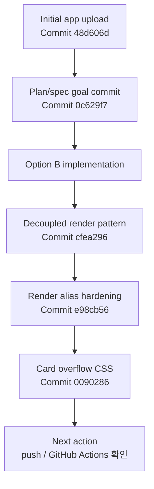

# CHANGELOG

이 문서는 현재 저장소 상태와 확인된 Git 이력을 기준으로 작성한다.

## Release / Verification State

## Unreleased - 2026-05-11 documentation refresh

현재 문서 갱신 작업은 로컬 변경이다.
런타임 코드는 이미 이전 커밋으로 배포되었고, 이번 섹션은 README, QA, 연결, UI/UX, render plan/spec 문서를 최신 상태로 맞추는 작업을 기록한다.

### Changed

- README의 stale direct-template 설명을 decoupled data/render 설명으로 수정했다.
- QA 문서에 production MCP smoke, Daily KPI Dashboard lock, widget overflow 확인 기준을 추가했다.
- ChatGPT 연결 문서에 production URL, refresh/reconnect 절차, Daily KPI 카드 확인 절차를 추가했다.
- UI/UX 사양에 `ask_hvdc_ontology` data-only와 `render_hvdc_answer_card` render-only 계약을 반영했다.

### Verification target

- `npm run verify`
- production MCP resource smoke
- ChatGPT 새 대화에서 카드 overflow 수동 확인

## 2026-05-11 - Decoupled render and card overflow hardening

Commits: `ce02ae3`, `e98cb56`, `cfea296`, `0090286`

### Changed

- `ask_hvdc_ontology`를 데이터 전용 tool로 전환했다.
- `ask_hvdc_ontology` 결과에서 `openai/outputTemplate`, `_meta.ui.resourceUri`, `structuredContent.ui`를 제거했다.
- `render_hvdc_answer_card`만 `ui://hvdc/answer-card-v6.html` template metadata를 소유하도록 했다.
- stale client 방어를 위해 `ui://hvdc/answer-card-v5.html`와 `ui://hvdc/render_hvdc_answer_card.html` alias resource를 유지한다.
- Daily KPI Dashboard lock 질문은 operations KPI summary와 Human-gate `WARN`으로 처리한다.
- 카드 CSS에서 긴 action명, protected fields, route reason, validation text가 잘리지 않도록 줄바꿈과 responsive grid를 보강했다.

### Verified

- 로컬에서 `npm run verify`를 실행했다.
- 결과: TypeScript typecheck 통과, 활성 Vitest 4개 파일 / 43개 테스트 통과.
- Railway production 배포 후 MCP smoke로 tool descriptor, resource alias, render-only template, ask data-only payload를 확인했다.
- ChatGPT 관리 화면에서 `render_hvdc_answer_card`와 `ui://hvdc/answer-card-v6.html` template 노출을 확인했다.
- ChatGPT 화면에서 `Failed to fetch template` 없이 Daily KPI 카드가 표시되는 것을 확인했다.

### Risks

- ChatGPT client cache가 남아 있으면 앱 refresh 또는 reconnect 후 새 대화에서 확인해야 한다.
- 카드 overflow 개선은 CSS와 production resource smoke로 검증했지만, 실제 화면 폭별 최종 캡처 확인은 별도 수동 확인이 필요하다.

## 2026-05-10 - Option B local implementation

초기 Option B 구현이다.

### Added

- 평가용 golden prompt를 11개로 확장했다.
- Apps SDK/MCP tool descriptor와 `chatgpt-app-submission.json`의 일치 여부를 확인하는 테스트를 추가했다.
- 위젯 UI가 verdict, route documents, evidence, validation, PII state, review warning, next action을 표시하도록 확장했다.
- corpus index가 stale 상태인지 확인하는 `scripts/check_index_drift.py`를 추가했다.

### Changed

- 근거가 질문을 실제로 뒷받침하지 않으면 evidence를 비우고 `NO_EVIDENCE`로 닫도록 답변 검증을 강화했다.
- Flow Code를 route, customs, invoice, KPI bucket 분류에 쓰려는 질문은 `BLOCK`으로 처리하도록 강화했다.
- write, send, export, report, invoice, cost, approval 관련 질문에는 Human-gate action을 붙이도록 강화했다.
- GitHub workflow의 index 검증 단계를 stale index 확인 방식으로 바꿨다.

### Verified

- 로컬에서 `npm run verify`를 실행했다.
- 결과: TypeScript typecheck 통과, 당시 활성 Vitest 4개 파일 / 23개 테스트 통과.
- 로컬에서 `python scripts/check_index_drift.py`를 실행했다.
- 결과: corpus index는 최신 상태이고 `source_role_map.json`은 유효한 JSON으로 확인됐다.

### Risks

- GitHub Actions 실행 결과는 이 문서 작성 시점에 별도로 확인해야 한다.
- security 문서 기준으로 Dependabot security updates와 code scanning은 아직 owner action이 필요하다.

## 2026-05-10 - Plan/spec goal commit

Commit: `0c629f7 Add operational improvement plan and spec`

### Added

- 운영 개선 목표 문서를 추가했다.
- 개선 spec 문서를 추가했다.
- 실행 계획 초안을 `docs/operations/plan.md`에 추가했다.

### Changed

- 초기 앱 업로드 이후, 구현 목표와 운영 개선 범위를 문서로 분리했다.

### Verified

- Git commit 이력과 commit stat으로 파일 추가 범위를 확인했다.

### Risks

- 이 커밋은 문서 중심 변경이다.
- 실제 runtime 구현 완료를 의미하지 않는다.

## 2026-05-10 - Initial app upload

Commit: `48d606d Initial HVDC ontology ChatGPT app`

### Added

- HVDC Ontology Grounded ChatGPT App의 초기 코드와 문서를 추가했다.
- Apps SDK/MCP 서버, corpus 검색, answer composition, redaction, routing, type 정의를 추가했다.
- approved ontology corpus와 index 파일을 추가했다.
- 초기 README, AGENTS.md, 보안 문서, QA 문서, 연결 문서를 추가했다.
- 초기 위젯 HTML과 pipeline test를 추가했다.
- Codex agent skill 문서를 `.agents/skills/` 아래에 추가했다.

### Changed

- 저장소의 기본 앱 구조와 검증 구조를 한 번에 만든 첫 업로드다.

### Verified

- Git commit 이력과 commit stat으로 초기 업로드 범위를 확인했다.

### Risks

- 초기 업로드는 넓은 범위의 scaffold다.
- 실제 운영 사용 전에는 각 tool contract, corpus grounding, privacy gate 검증이 필요하다.
