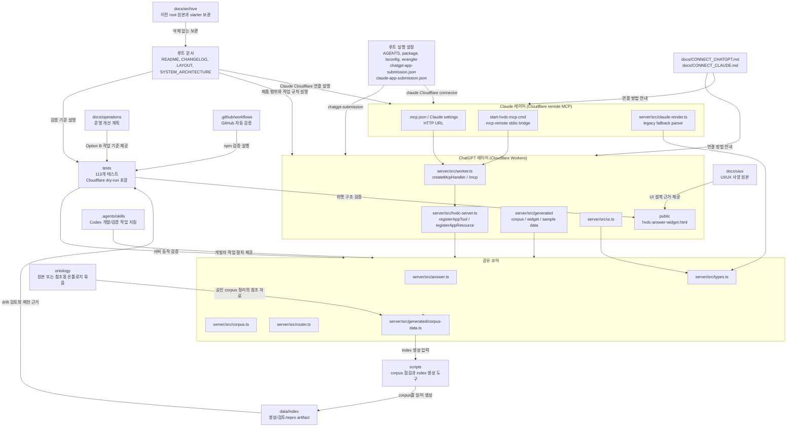

# Repository Layout

이 문서는 `rg --files`와 현재 `git status --short`로 확인한 실제 저장소 구조를 요약한다.
새 경로를 가정하지 않고, 현재 루트에 있는 파일과 디렉터리만 적었다.

## 폴더 관계 그래프

아래 그래프는 주요 폴더가 어떤 역할로 연결되는지 보여준다.
런타임 검색 기준은 `server/src/generated/corpus-data.ts`이고, `data/corpus`는 generated module을 만드는 승인 원본이다. `data/index`는 생성, 검토, 재현을 위한 산출물이다.

## 루트 파일

- `AGENTS.md`: 작업 규칙과 HVDC 온톨로지 답변 앱의 안전 경계를 정한다. ChatGPT/Claude 양쪽 레이어 설명 포함.
- `README.md`: 프로젝트 소개와 사용 흐름을 설명하는 루트 안내 문서다.
- `CHANGELOG.md`: 변경 이력을 기록하는 문서다.
- `LAYOUT.md`: 현재 저장소 구조와 미커밋 변경 범위를 설명하는 이 문서다.
- `SYSTEM_ARCHITECTURE.md`: 시스템 구조를 설명하는 문서다. ChatGPT/Claude 양쪽 아키텍처 포함.
- `package.json`: 앱 이름, Cloudflare Worker 실행 스크립트, Node fallback, Claude Cloudflare bridge 실행 스크립트를 정의한다.
- `package-lock.json`: npm 의존성 잠금 파일이다.
- `tsconfig.json`: TypeScript 컴파일 설정이다.
- `wrangler.toml`: Cloudflare Workers, R2, D1 배포 설정 파일이다.
- `chatgpt-app-submission.json`: ChatGPT 앱 제출용 메타데이터 파일이다.
- `claude-app-submission.json`: Claude 앱 연결 설정 파일이다. Cloudflare MCP URL, `claude_desktop_config` HTTP 스니펫, 11개 tool, Claude 전용 테스트 케이스 포함.
- `.gitignore`: Git 추적에서 제외할 폴더와 파일 패턴을 정한다.

## docs

`docs/`는 제품 사양, 계획, 보안, QA, 연결 방법을 담는 문서 폴더다.

- `docs/PLAN.md`: 구현 계획과 단계별 작업 기준이다.
- `docs/SPEC.md`: 제품과 도구 동작의 상세 사양이다.
- `docs/SECURITY_PRIVACY.md`: 보안과 개인정보 처리 기준이다.
- `docs/QA_REPORT.md`: 검증 결과와 품질 확인 내용을 기록한다.
- `docs/CONNECT_CHATGPT.md`: ChatGPT 연결 방법을 설명한다.
- `docs/CONNECT_CLAUDE.md`: Claude Desktop / Claude Code / claude.ai를 Cloudflare MCP에 연결하는 방법을 설명한다. `claude_desktop_config.json` HTTP 예시와 테스트 프롬프트 5개 포함.
- `docs/CODEX_SETUP.md`: Codex 작업 환경 설정 안내다.
- `docs/SPEC_IMPROVEMENTS.md`: 사양 개선 메모다.
- `docs/claude-plan-20260511.md`: Claude App Layer 구현 계획 문서다 (Phase 1 CEO review, Phase 2 Engineering review 포함).
- `docs/codex/AGENTS.patched.md`: 루트에 남기지 않는 Codex 지침 초안 보관본이다.
- `docs/operations/plan.md`: Option B 운영 개선 실행 계획이다.
- `docs/uiux/HVDC_Ontology_Grounded_ChatGPT_App_UIUX_Spec_2026-05-10.md`: UI/UX 사양 문서의 Markdown 버전이다.
- `docs/uiux/HVDC_Ontology_Grounded_ChatGPT_App_UIUX_Spec_2026-05-10.docx`: UI/UX 사양 문서의 Word 버전이다.
- `docs/archive/root-originals/`: 루트에 있던 날짜형 계획/사양 원본을 삭제하지 않고 보관한다.
- `docs/archive/starter/`: starter 폴더와 starter zip을 삭제하지 않고 보관한다.

## server/src

`server/src/`는 MCP 서버와 온톨로지 기반 답변 로직을 담는 TypeScript 소스 폴더다.

### 공유 코어 (ChatGPT/Claude 공통)
- `server/src/answer.ts`: 검색 결과를 근거로 답변을 구성하는 로직을 담는다.
- `server/src/corpus.ts`: Worker 번들에 포함된 generated corpus를 검색하는 로직을 담는다.
- `server/src/router.ts`: 질문을 HVDC 도메인 라우트로 분류하는 로직을 담는다.
- `server/src/redact.ts`: 이메일과 전화번호 같은 민감정보를 가리는 로직을 담는다.
- `server/src/types.ts`: 서버 내부에서 공유하는 타입을 정의한다.

### ChatGPT 레이어
- `server/src/worker.ts`: Cloudflare Worker 진입점. `agents/mcp`의 `createMcpHandler`로 `/mcp`를 처리한다.
- `server/src/hvdc-server.ts`: ChatGPT 전용 MCP server factory. `@modelcontextprotocol/ext-apps`의 `registerAppTool`, `registerAppResource` 사용.
- `server/src/index.ts`: Node fallback 진입점. 로컬 디버깅이 필요할 때 `npm run node:dev`로 실행한다.
- `server/src/ui.ts`: ChatGPT 위젯 UI 상태 빌더. `ui://hvdc/answer-card-v7.html` 등록 헬퍼.

### Claude 레이어
- `.mcp.json`: Claude Code project 설정이다. `hvdc-ontology`을 Cloudflare HTTP MCP URL로 연결한다.
- `start-hvdc-mcp.cmd`: stdio만 지원하는 client를 위한 bridge다. 로컬 서버가 아니라 `mcp-remote`로 Cloudflare MCP에 연결한다.
- `server/src/claude-server.ts`: legacy/local fallback과 tool parity 테스트용 서버다. 운영 연결 기준은 Cloudflare remote MCP다.
- `server/src/claude-render.ts`: ChatGPT format(`_meta` 포함)과 Claude format(직접 GroundedAnswer) 양쪽 파싱 후 마크다운 카드 렌더링.

## public

`public/`은 ChatGPT 앱에서 표시할 정적 UI 파일을 담는다.

- `public/hvdc-answer-widget.html`: HVDC 답변 위젯 화면이다. 현재 v7 answer card resource, v6 previous alias, v5 legacy alias, render tool alias가 모두 같은 HTML을 사용한다. 긴 action명과 protected-field 목록은 카드 안에서 줄바꿈되도록 CSS가 들어 있다.

## tests

`tests/`는 Vitest 기반 자동 검증과 골든 프롬프트 데이터를 담는다. 현재 총 113개 테스트가 통과한다.

- `tests/pipeline.test.ts`: 답변 파이프라인의 기본 동작을 검증한다.
- `tests/descriptor.test.ts`: ChatGPT 앱 descriptor와 `chatgpt-app-submission.json` 일치를 검증한다.
- `tests/write-upload-tools.test.ts`: OAuth Bearer 보호 upload/write tool의 fail-closed 동작과 승인된 dry-run/commit 경로를 검증한다.
- `tests/evals.test.ts`: 평가 시나리오를 검증한다.
- `tests/widget.test.ts`: 공개 위젯 HTML의 기대 요소, bridge fallback, 외부 fetch 금지, overflow-safe CSS를 검증한다.
- `tests/claude-descriptor.test.ts`: Claude 서버 tool parity, 양방향 포맷 파싱(`parseGroundedAnswer`), 마크다운 렌더링 필수 필드를 검증한다. (29개 테스트)
- `tests/golden_prompts.json`: HVDC 도메인 질문과 기대 판정 데이터를 담는다.

## scripts

`scripts/`는 저장소 데이터를 만들거나 점검하는 보조 스크립트를 담는다.

- `scripts/index_corpus.py`: `data/corpus/` 문서를 읽어 index 산출물을 만드는 스크립트다.
- `scripts/check_index_drift.py`: corpus와 index 사이의 불일치를 확인하는 스크립트다.

## data/corpus

`data/corpus/`는 런타임 검색에 쓰는 승인된 온톨로지 corpus 문서 폴더다.

- `CONSOLIDATED-00-master-ontology.md`: master ontology 문서다.
- `CONSOLIDATED-01-core-framework-infra.md`: core framework와 infra 문서다.
- `CONSOLIDATED-02-warehouse-flow.md`: warehouse flow 문서다.
- `CONSOLIDATED-03-document-ocr.md`: document와 OCR 문서다.
- `CONSOLIDATED-04-barge-bulk-cargo.md`: barge와 bulk cargo 문서다.
- `CONSOLIDATED-05-invoice-cost.md`: invoice와 cost 문서다.
- `CONSOLIDATED-06-material-chain.md`: material chain 문서다.
- `CONSOLIDATED-07-port-operations.md`: port operations 문서다.
- `CONSOLIDATED-08-communication.md`: communication 문서다.
- `CONSOLIDATED-09-operations.md`: operations 문서다.
- `Team_역할분담_매트릭스.md`: 팀 역할 분담 문서다.

## data/index

`data/index/`는 corpus 변경을 리뷰하고 재현하기 위한 index 산출물과 역할 매핑 데이터를 담는다. 현재 런타임 검색은 `server/src/generated/corpus-data.ts`를 읽는다.

- `data/index/corpus_index.json`: corpus 문서와 section preview를 담는 생성 산출물이다.
- `data/index/corpus_inventory.csv`: corpus 파일 목록과 해시 같은 inventory 데이터다.
- `data/index/source_role_map.json`: source와 role 연결 정보를 담는다.

## ontology

`ontology/`는 원본 또는 참조용 온톨로지 문서 묶음을 담는다.
`data/corpus/`와 파일명이 일부 다르므로, 런타임 검색 기준은 `data/corpus/`를 우선 확인해야 한다. `data/index/`는 corpus 변경 리뷰와 재현성 확인 기준으로 별도 확인한다.

- `ontology/CONSOLIDATED-00-master-ontology.md`
- `ontology/CONSOLIDATED-01-core-framework-infra.md`
- `ontology/CONSOLIDATED-02-warehouse-flow.md`
- `ontology/CONSOLIDATED-03-document-ocr.md`
- `ontology/CONSOLIDATED-04-barge-bulk-cargo.md`
- `ontology/CONSOLIDATED-05-invoice-cost.md`
- `ontology/CONSOLIDATED-06-material-handling.md`
- `ontology/CONSOLIDATED-07-port-operations (1).md`
- `ontology/CONSOLIDATED-08-communication.md`
- `ontology/CONSOLIDATED-09-operations.md`
- `ontology/HVDC_Logistics_Ontology.combined.md`
- `ontology/Team_역할분담_매트릭스.md`

## .agents

`.agents/`는 이 저장소 전용 Codex Agent Skill 문서를 담는다.
런타임 앱 도구가 아니라 개발과 검증 작업을 돕는 지침이다.

- `.agents/skills/answer-grounding/SKILL.md`: 근거 기반 답변 흐름 작업 지침이다.
- `.agents/skills/mcp-tool-contract/SKILL.md`: MCP 도구 계약 작업 지침이다.
- `.agents/skills/ontology-corpus-indexer/SKILL.md`: ontology corpus index 작업 지침이다.
- `.agents/skills/privacy-redactor/SKILL.md`: 개인정보 마스킹 작업 지침이다.
- `.agents/skills/submission-readiness/SKILL.md`: 제출 준비 점검 지침이다.
- `.agents/skills/uiux-component/SKILL.md`: UI 컴포넌트 작업 지침이다.
- `.agents/skills/validation-gate/SKILL.md`: validation gate 작업 지침이다.

## .github

`.github/`는 GitHub 자동 검증 설정을 담는다.

- `.github/workflows/hvdc-verify.yml`: TypeScript와 테스트 검증을 실행하는 GitHub Actions workflow다.

## 현재 미커밋 변경: Cloudflare protected upload/write tool

현재 작업 트리에는 Cloudflare Workers/R2/D1 기반 upload/write tool 후속 변경이 있다.
이 문서는 해당 변경을 되돌리지 않고, 현재 상태를 기록한다.

- Protected runtime: `server/src/worker.ts`, `server/src/hvdc-server.ts`, `server/src/claude-server.ts`
- Cloudflare storage: `migrations/0001_mcp_audit_logs.sql`, `migrations/0002_mcp_upload_write.sql`, R2 binding `HVDC_FILES`, D1 binding `MCP_AUDIT_DB`
- Submission metadata: `chatgpt-app-submission.json`, `claude-app-submission.json`
- Regression: `tests/write-upload-tools.test.ts`, `tests/descriptor.test.ts`, `tests/claude-descriptor.test.ts`
- 검증: focused protected-tool tests, `npm run typecheck`, full `npm run verify`

## 무시된 폴더와 파일

`.gitignore` 기준으로 아래 항목은 Git 추적에서 제외된다.

- `node_modules/`: 설치된 npm 의존성 폴더다.
- `out/`: 빌드 또는 실행 결과 산출물 폴더다.
- `.playwright-mcp/`: Playwright MCP 실행 관련 로컬 상태 폴더다.
- `docs/archive/starter/hvdc-ontology-chatgpt-app-starter/`: starter 폴더다.
- `docs/archive/starter/hvdc-ontology-chatgpt-app-starter.zip`: starter 압축 파일이다.
- `__pycache__/`: Python 캐시 폴더다.

## Evidence Trace Mode layout addendum - 2026-05-11

이 추가 섹션은 기존 구조 설명을 지우지 않고, Evidence Trace Mode 구현 이후의 최신 위치만 덧붙입니다.

### Root documentation updates

- `AGENTS.md`: Evidence Trace Mode 작업 규칙, trace support state, data-only tool boundary, verification gates를 추가로 설명합니다.
- `README.md`: 사용자가 보는 근거 연결 표시, `No direct evidence`, Claude markdown trace, 최신 검증 범위를 설명합니다.
- `CHANGELOG.md`: Evidence Trace Mode 추가, 변경, 검증, 한계를 변경 이력으로 기록합니다.
- `LAYOUT.md`: 이 저장소 구조 문서에 Evidence Trace Mode 파일 위치와 검증 범위를 추가합니다.
- `SYSTEM_ARCHITECTURE.md`: 서버, 위젯, Claude 렌더러 사이의 trace 데이터 흐름을 추가로 설명합니다.

### Runtime and shared-core updates

- `server/src/types.ts`: `EvidenceTraceItem` and `GroundedAnswer.evidenceTrace` define the trace contract.
- `server/src/answer.ts`: answer composition builds trace entries for summary, business impact, details, and actions.
- `server/src/hvdc-server.ts`: ChatGPT render schema accepts `evidenceTrace` and defaults legacy input to an empty array.
- `server/src/claude-server.ts`: Claude render schema accepts the same trace field.
- `server/src/claude-render.ts`: Claude markdown renders an `Evidence Trace` section and strips UI-only fields.
- `public/hvdc-answer-widget.html`: ChatGPT widget shows trace chips, `No direct evidence`, raw evidence IDs, and connected answer statements.

### Operations documents added

- `docs/operations/evidence-trace-mode-plan.md`: implementation plan for Evidence Trace Mode.
- `docs/operations/evidence-trace-mode-spec.md`: contract-style specification for Evidence Trace Mode.

### Test coverage added or expanded

- `tests/pipeline.test.ts`: supported trace, no-direct-evidence trace, and blocked-answer trace preservation.
- `tests/widget.test.ts`: trace chip rendering, `No direct evidence`, raw evidence IDs, connected statements, and external fetch blocking.
- `tests/descriptor.test.ts`: render tool compatibility when legacy input omits `evidenceTrace`.
- `tests/claude-descriptor.test.ts`: Claude markdown trace rendering.

Latest observed local verification for this addendum:
- Command: `npm run verify`
- Result: TypeScript check passed, Vitest passed 8 test files with 113 tests, and Wrangler Worker dry-run passed.

### Stale-count warning

Older archived files may still mention earlier 71/78-test snapshots.
For the active repository, use the latest 113-test verification note above as the current local evidence.
