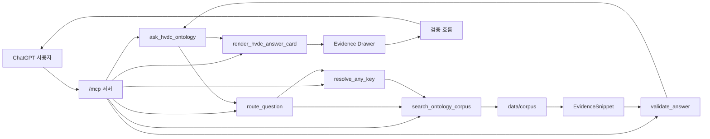

# HVDC Ontology Grounded ChatGPT App

쉽게 말하면: 이 저장소는 HVDC 물류 질문에 대해 먼저 온톨로지 corpus를 찾고, 근거가 있을 때만 ChatGPT App 안에서 답변하는 로컬 MVP입니다.

현재 상태는 Option B + 공식 decoupled render pattern 기준입니다. MCP 서버, 6개 tool, 온톨로지 corpus 색인, Evidence Drawer 위젯, golden eval, GitHub Actions 검증이 들어 있습니다.

## 현재 구현 범위

| 영역 | 상태 |
|---|---|
| MCP 서버 (ChatGPT) | `server/src/index.ts`에서 `/mcp` 엔드포인트를 실행합니다. 기본 로컬 주소는 `http://localhost:8787/mcp`입니다. |
| MCP 서버 (Claude) | `server/src/claude-server.ts`에서 `/mcp` 엔드포인트를 실행합니다. 기본 로컬 주소는 `http://localhost:8788/mcp`입니다. ChatGPT-specific ext-apps 없이 표준 MCP SDK만 사용합니다. |
| ChatGPT App UI | `public/hvdc-answer-widget.html`이 Answer Card와 Evidence Drawer를 렌더링합니다. 카드 UI 실패는 업무 결과 실패로 올리지 않으며, 긴 action/meta 텍스트는 카드 안에서 줄바꿈합니다. |
| Corpus | `ontology/` 원본을 바탕으로 `data/corpus/`에 승인 문서를 둡니다. |
| Index | `data/index/`에 `corpus_index.json`, `corpus_inventory.csv`, `source_role_map.json`을 생성합니다. |
| 검증 | golden prompt, descriptor contract, widget, pipeline 테스트가 있습니다. |
| CI | `.github/workflows/hvdc-verify.yml`이 index 재생성, drift check, JSON 검증, typecheck/test를 실행합니다. |

## Source of Truth

답변과 검증은 아래 순서로 확인합니다.

1. `data/corpus/CONSOLIDATED-00-master-ontology.md`
2. 관련 extension corpus 문서: `data/corpus/CONSOLIDATED-01`부터 `CONSOLIDATED-09`
3. 서버 구현: `server/src/`
4. UI 위젯: `public/hvdc-answer-widget.html`
5. 제출 메타데이터: `chatgpt-app-submission.json`
6. 색인과 역할 매핑: `data/index/`
7. 테스트와 golden fixture: `tests/`

근거가 없는 route, 비용 규칙, 승인 규칙, compliance 판단은 README나 앱 답변에 추가하지 않습니다.

## MCP tools

ChatGPT 서버(포트 8787)와 Claude 서버(포트 8788)가 동일한 6개 tool 이름을 공유합니다.

- `ask_hvdc_ontology`: 질문을 route, corpus search, validation, answer object로 처리합니다. 이 tool은 데이터 전용이며 `openai/outputTemplate`, `_meta.ui.resourceUri`, `structuredContent.ui`를 붙이지 않습니다.
- `render_hvdc_answer_card`: `ask_hvdc_ontology` 결과를 받아 렌더링합니다. ChatGPT 서버는 `ui://hvdc/answer-card-v7.html` 카드 UI로, Claude 서버는 마크다운 카드로 출력합니다. 이 tool만 카드 template metadata를 소유합니다.
- `route_question`: 질문을 HVDC 도메인과 required corpus 문서로 분류합니다.
- `search_ontology_corpus`: 승인된 `data/corpus/` 문서에서 EvidenceSnippet을 찾습니다.
- `resolve_any_key`: BL, BOE, DO, Invoice, HVDC code, site, milestone 같은 식별자를 후보로 풉니다.
- `validate_answer`: CONSOLIDATED-00 포함, 근거 존재, 최신성, Human-gate, Flow Code 경계를 검사합니다.

## 전체 흐름

쉽게 말하면: ChatGPT 사용자의 질문은 `/mcp` 서버로 들어오고, `ask_hvdc_ontology`가 `data/corpus/` 근거를 찾습니다. 이후 시각 카드가 필요하면 ChatGPT가 `render_hvdc_answer_card`를 호출하고, 이 render tool만 `ui://hvdc/answer-card-v7.html` 카드 UI를 연결합니다. 카드 template 로딩이 실패해도 `verdict`, `validationStatus`, `evidenceIds`, `actions`는 바꾸지 않고 텍스트 fallback을 보여줍니다.



## 데이터와 색인

`data/corpus/`에는 `CONSOLIDATED-00`부터 `CONSOLIDATED-09`까지의 문서와 `Team_역할분담_매트릭스.md`가 들어 있습니다.

색인은 아래 명령으로 다시 만듭니다.

```bash
npm run index
```

GitHub Actions와 로컬 검증은 `scripts/check_index_drift.py`로 생성된 색인이 커밋된 색인과 달라졌는지 확인합니다. corpus를 바꾼 뒤 index를 다시 만들지 않으면 CI에서 실패할 수 있습니다.

## 실행 명령

의존성 설치:

```bash
npm install
```

ChatGPT 서버 실행 (포트 8787):

```bash
npm run dev
```

Claude 서버 실행 (포트 8788):

```bash
npm run claude:dev
```

두 서버는 동시에 실행할 수 있습니다. 공유 코어(`answer.ts`, `corpus.ts`, `router.ts`, `types.ts`)는 변경 없이 재사용합니다.

예상 출력:

```text
HVDC Ontology MCP server listening on http://localhost:8787/mcp
HVDC Ontology Claude MCP server listening on http://localhost:8788/mcp
```

포트 변경은 환경변수로 가능합니다:

```bash
PORT=9000 npm run dev          # ChatGPT 서버
CLAUDE_PORT=9001 npm run claude:dev  # Claude 서버
```

Corpus index 재생성:

```bash
npm run index
```

TypeScript 검사와 테스트 실행 (71개 테스트):

```bash
npm run verify
```

## Claude 연결

Claude Desktop 또는 Claude Code에서 연결하는 방법은 `docs/CONNECT_CLAUDE.md`를 참고합니다.

`claude_desktop_config.json` 빠른 설정:

```json
{
  "mcpServers": {
    "hvdc-ontology": {
      "command": "npm",
      "args": ["run", "claude:start"],
      "cwd": "/path/to/HVDC-Ontology-Grounded"
    }
  }
}
```

`render_hvdc_answer_card`는 ChatGPT format(`_meta` 포함)과 Claude format(직접 GroundedAnswer) 모두 파싱합니다. 두 포맷을 같은 마크다운 카드로 출력합니다.

## ChatGPT 연결

로컬 개발에서는 HTTPS 터널을 열고 ChatGPT App connector URL에 `/mcp` 주소를 넣습니다.

예:

```text
https://<your-ngrok-subdomain>.ngrok.app/mcp
```

ChatGPT App UI resource URI는 아래 값입니다.

```text
ui://hvdc/answer-card-v7.html
```

호환성 resource alias:

```text
ui://hvdc/answer-card-v6.html
ui://hvdc/answer-card-v5.html
ui://hvdc/render_hvdc_answer_card.html
```

위 alias는 오래된 ChatGPT client/session이 이전 template URI 또는 render tool 이름을 resource처럼 요청할 때 같은 HTML을 반환하기 위한 방어용 경로입니다.

Railway MCP URL은 `docs/operations/plan.md`에 아래 값으로 문서화되어 있습니다.

```text
https://hvdc-ontology-chatgpt-app-production.up.railway.app/mcp
```

주의: 이 README는 URL이 문서에 적혀 있음을 말합니다. 현재 배포가 살아 있는지는 별도 실행 확인이 필요합니다.

## Evidence Drawer

Evidence Drawer는 답변 근거를 사용자가 확인할 수 있게 보여줍니다.

표시 대상:

- source document
- section path
- document hash
- confidence
- validation status
- PII state
- stale or review warnings

위젯은 외부 URL을 직접 fetch하지 않습니다. ChatGPT App tool result의 structured content를 기준으로 표시합니다.

UI 상태는 업무 판정과 분리합니다.

- `ask_hvdc_ontology` 결과에는 `ui` 객체가 없습니다.
- `render_hvdc_answer_card` 결과에서만 `ui.templateUrl`, `templateVersion`, `schemaVersion`을 붙입니다.
- `dataStatus: OK`이면 ontology answer JSON은 업무 결과로 사용할 수 있습니다.
- `uiRenderStatus: TEMPLATE_FETCH_FAILED` 또는 `FALLBACK_RENDERED`이면 카드 template 표시만 실패했거나 fallback으로 전환된 상태입니다.
- `businessResultVisible: true`이면 텍스트 fallback으로 핵심 결과를 볼 수 있습니다.
- `doNotChange` 필드인 `verdict`, `validationStatus`, `evidenceIds`, `actions`는 UI 실패 때문에 바꾸지 않습니다.

Daily KPI Dashboard 질문은 operations KPI로 우선 라우팅합니다. `DET/DEM`은 CostGuard invoice audit이 아니라 지연과 비용 노출을 보는 operations risk KPI로 집계합니다. `Owner / Risk / Next Action` 잠금은 Human-gate `WARN`으로 처리합니다.

## 운영 안전 기준

이 앱은 일반 챗봇이 아니라 HVDC Project Logistics 전용 근거 기반 답변 앱입니다.

Human-gate가 필요한 작업:

- ERP, WMS, ATLP, Foundry 같은 운영 시스템 write-back
- WhatsApp, email, TG 같은 외부 메시지 전송
- 보고서 publication 또는 외부 export
- transaction mutation 또는 cost approval
- invoice 또는 CostGuard 답변이 `100,000.00 AED`를 넘거나 `HIGH` / `CRITICAL` risk인 경우
- deployment, Railway config, auth, secret, token, `.env*`, CI/CD 변경

최신 승인 source가 필요한 질문:

- FANR, DCD, MOIAT, ADNOC, CICPA
- Gate Pass, permit, tariff, rate, law, regulation, Incoterms

개인정보와 감사 로그:

- email은 `[EMAIL_MASKED]`로 표시합니다.
- phone number는 `[PHONE_MASKED]`로 표시합니다.
- token-like 문자열은 노출하지 않습니다.
- `out/audit.jsonl`은 hash 기반 로컬 감사 로그입니다. 운영 시스템 변경 기록이 아닙니다.

Codex Skills는 개발 지침입니다. `.agents/skills/*/SKILL.md`는 runtime app tool이 아니며, ChatGPT App에서 직접 호출되는 tool은 위 6개 MCP tool뿐입니다.

## Golden evals

`tests/golden_prompts.json`과 `tests/evals.test.ts`는 주요 업무 질문이 기대 verdict, validation rule, required document, evidence 조건을 만족하는지 확인합니다.

대표 시나리오:

- `AGI M130 닫아도 돼?`는 MOSB/LCT chain evidence가 없으면 `BLOCK`입니다.
- `Flow Code 어디에 써?`는 WHP-only 경계를 확인합니다.
- invoice, cost, report, send, export 질문은 Human-gate 필요 여부를 확인합니다.
- 근거가 없으면 EvidenceSnippet 없이 답변을 만들지 않고 fail-safe verdict로 멈춥니다.
- Daily KPI Dashboard 잠금 질문은 invoice/cost 감사 근거 묶음 문구 없이 operations dashboard summary와 Human-gate next action을 반환해야 합니다.
- 이메일과 전화번호는 답변 텍스트에 원문이 남지 않아야 합니다.

## Fail-safe behavior

| 상태 | 조건 | 동작 |
|---|---|---|
| `NO_EVIDENCE` | 질문을 뒷받침할 corpus 근거가 없음 | 답변을 중단하고 source 또는 identifier를 요구합니다. |
| `BLOCK` | `CONSOLIDATED-00` 근거 누락, AGI/DAS M130 선행 근거 누락, Flow Code 오용 등 | 업무 승인이나 close 판단을 하지 않습니다. |
| `WARN` | 최신 법규, 요율, SOP, cost, invoice, report, send/export 같은 검토 대상 | 최신 승인 source 또는 Human-gate를 요구합니다. |
| `INFO` | Flow Code 의미 설명처럼 업무 경계 설명이 중심인 경우 | WHP-only 같은 의미 경계를 설명합니다. |

카드 UI 표시 실패는 위 업무 판정을 바꾸지 않습니다. 이 경우 `uiRenderStatus`만 `TEMPLATE_FETCH_FAILED` 또는 `FALLBACK_RENDERED`로 분리하고, 텍스트 fallback으로 같은 업무 결과를 표시합니다.

## 현재 한계

- 이 MVP는 corpus-only RAG입니다. live KG, ERP, WMS, Foundry write-back은 구현 범위 밖입니다.
- 운영 write, 외부 메시지 전송, 보고서 publication, 비용 승인에는 Human-gate가 필요합니다.
- Railway production MCP는 2026-05-11 현재 smoke 기준으로 최신 decoupled render contract와 widget overflow CSS를 반환했습니다. 실제 ChatGPT 화면은 client cache나 세션 상태에 따라 새 대화 또는 앱 재연결 후 확인해야 합니다.
- Claude 서버(`server/src/claude-server.ts`)는 `render_hvdc_answer_card`를 마크다운 텍스트로 반환합니다. ChatGPT iframe 위젯 렌더링은 ChatGPT 서버(포트 8787) 전용입니다.
- `query_knowledge_graph`, `create_action_request`, `export_answer_report`는 계획 문서에 있는 확장 tool입니다. 현재 서버 tool 6개에는 포함되지 않습니다.

## 문서 위치

루트에는 GitHub 대문과 핵심 운영 문서만 둡니다.

- `README.md`
- `SYSTEM_ARCHITECTURE.md`
- `LAYOUT.md`
- `CHANGELOG.md`

보조 문서는 하위 폴더에 둡니다.

- 운영 개선 계획: `docs/operations/plan.md`
- UI/UX 사양: `docs/uiux/`
- Claude 연결 안내: `docs/CONNECT_CLAUDE.md`
- ChatGPT 연결 안내: `docs/CONNECT_CHATGPT.md`
- Codex 지침 보관본: `docs/codex/AGENTS.patched.md`
- 이전 root 원본과 starter 보관본: `docs/archive/`

## 확인 기준

README를 바꾼 뒤에는 아래 순서로 확인합니다.

```bash
npm run index
python scripts/check_index_drift.py
npm run verify
```

CI 설치 확인에는 아래 명령을 사용합니다.

```bash
npm ci
```

`npm run verify`는 `tsc --noEmit`과 `vitest run --exclude docs/archive/**`를 실행합니다.

## Evidence Trace Mode - 2026-05-11

Evidence Trace Mode adds statement-level evidence visibility to grounded answers.
쉽게 말하면, 답변 문장 옆에 어떤 근거 조각을 보고 말했는지 표시합니다.

Current behavior:
- `ask_hvdc_ontology` can return `evidenceTrace` in the answer JSON while staying data-only.
- `render_hvdc_answer_card` owns the ChatGPT answer-card display.
- `public/hvdc-answer-widget.html` shows trace chips next to summary, business impact, detail, and action statements.
- The widget shows short labels such as `E1`, but the Evidence Drawer keeps the raw evidence ID.
- If a statement has no direct supporting snippet, the UI shows `No direct evidence` instead of creating fake support.
- The drawer can show connected answer statements for each evidence item.
- Claude markdown rendering includes an `Evidence Trace` section.
- Legacy render input without `evidenceTrace` is accepted and treated as an empty trace list.

Scope limits:
- Evidence trace is a display and explanation layer, not a scoring engine.
- Evidence trace does not replace `verdict`, `validationStatus`, or the main `evidenceIds` list.
- Action statements can be `NO_DIRECT_EVIDENCE` when they are workflow recommendations rather than direct corpus claims.
- Trace data is corpus-only and does not represent live ERP, WMS, ATLP, or KG lineage.

Verification coverage added for this mode:
- `tests/pipeline.test.ts` checks supported trace, no-evidence trace, and blocked-answer trace preservation.
- `tests/widget.test.ts` checks trace chips, `No direct evidence`, raw evidence IDs, connected statements, and external fetch blocking.
- `tests/descriptor.test.ts` checks the render tool fallback when legacy input omits `evidenceTrace`.
- `tests/claude-descriptor.test.ts` checks Claude markdown trace output.

Latest local verification observed for this feature:
- Command: `npm run verify`
- Result: TypeScript check passed, and Vitest passed 5 test files with 78 tests.
- Meaning: the current implementation and tests agree on the Evidence Trace Mode contract.
