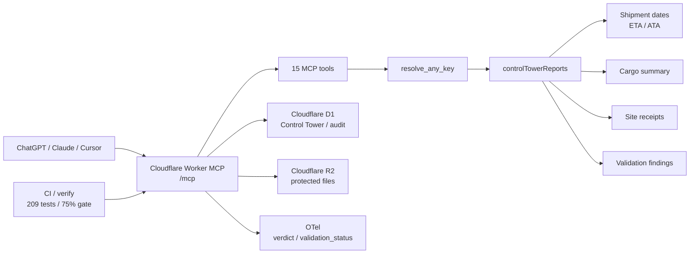
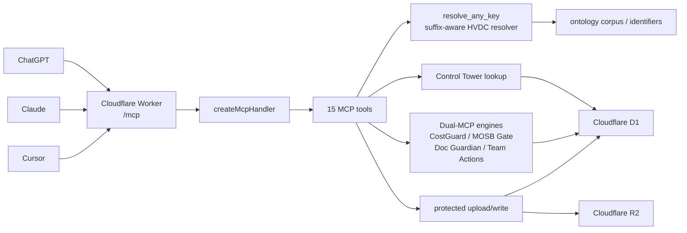
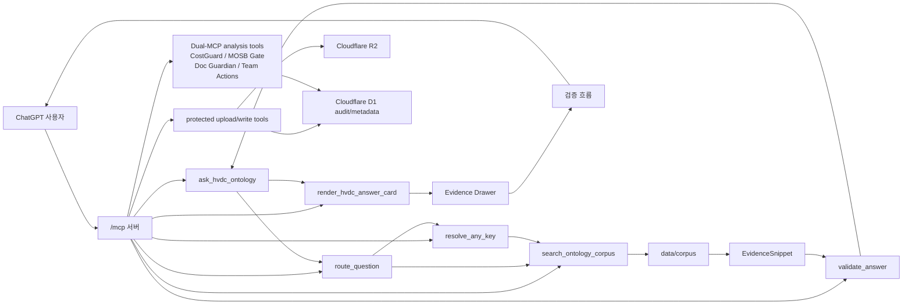
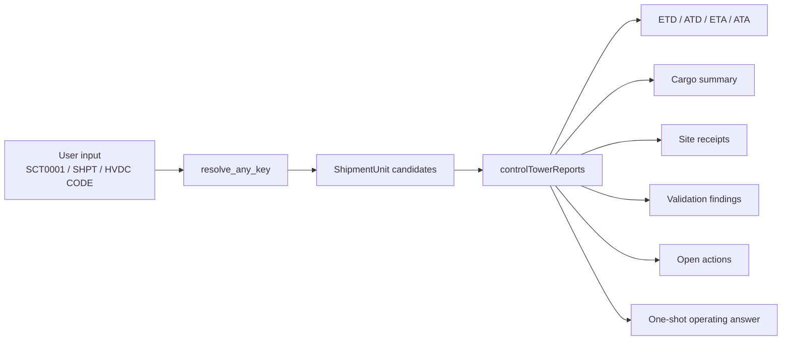

# HVDC Ontology Grounded ChatGPT App

쉽게 말하면: 이 저장소는 HVDC 물류 질문에 대해 먼저 온톨로지 corpus를 찾고, 근거가 있을 때만 Cloudflare Workers 기반 ChatGPT App MCP 서버에서 답변합니다.

현재 상태는 Cloudflare Workers 운영 기준입니다. MCP 서버, 15개 tool, Dual-MCP 검증 엔진, 온톨로지 corpus 번들, Evidence Drawer 위젯, OAuth Bearer 보호 upload/write 도구, D1 감사 로그, R2 파일 저장소, golden eval, GitHub Actions 검증이 들어 있습니다.

## Overview

이 프로젝트는 Cloudflare Workers 기반 ChatGPT Apps MCP 서버, HVDC ontology corpus 검색, Decision Card v2.1, Case Status Card, D1/R2 운영 저장소, 그리고 WH status case-event SSOT projection을 한 저장소에서 관리합니다.

## Quick Start

1. `npm ci`로 의존성을 설치합니다.
2. `npm run generate:worker-assets`로 Worker 번들 자산을 재생성합니다.
3. `npm run verify`로 typecheck, tests, Worker dry-run을 실행합니다.
4. `npm run worker:deploy`로 검증 후 Cloudflare Worker에 배포합니다.

## Secret Setup

Axiom OTLP 관찰성을 활성화하려면 배포 전 한 번만 실행합니다.

```bash
wrangler secret put AXIOM_TOKEN
```

`AXIOM_DATASET`은 이미 `wrangler.toml`에 설정되어 있으므로 토큰만 secret으로 등록하면 됩니다. 자세한 Axiom 쿼리, 알림 임계값, 운영 체크리스트는 [`docs/observability-runbook.md`](docs/observability-runbook.md)를 참조하십시오.


## 2026-05-25 Current Operating Snapshot

쉽게 말하면: 현재 운영 기준은 Cloudflare Worker `main` commit `5af135f`, Widget v10, Case Status Card, WH status D1 projection, 그리고 302-test release gate입니다. 자세한 최신 동기화 문서는 `docs/SYSTEM_ARCHITECTURE.md`, `docs/LAYOUT.md`, `docs/GUIDE.md`, `docs/CHANGELOG.md`를 보십시오.

| 항목 | 최신 기준 | 검증 또는 코드 근거 |
|---|---|---|
| GitHub main HEAD | `5af135f` | `fix: contain case status tables in widget card` pushed to `origin/main`. |
| Cloudflare Worker | Version ID `fcad3b6d-1ee5-420f-b3e7-3a030e5210f5` | `npm run worker:deploy` completed after `npm run verify`. |
| Widget resource | `ui://hvdc/answer-card-v10.html` | `server/src/hvdc-server.ts` resource metadata and deployed MCP smoke. |
| Verification | 22 test files / 302 tests passed | `npm run worker:deploy` internal `npm run verify`. |
| Case status smoke | `WHCASE-207721`, `WARN`, `M100_FINAL_DELIVERED`, `canonicalEvents=6`, `caseCard=36` | `/mcp get_hvdc_case_status caseNo=207721` with MCP Accept header. |
| WH status workflow | Excel -> D1 projection -> case card / canonical events | `scripts/seed_wh_status_d1.py`, `migrations/0006_wh_status_case_card.sql`, `migrations/0007_case_event_ssot.sql`. |
## 2026-05-15 Latest Operating Snapshot

쉽게 말하면: GitHub main 화면의 현재 기준은 Cloudflare 운영 Worker와 `main` commit `91f6329`입니다. 아래 표가 최신 source of truth이며, 이전 2026-05-14/2026-05-15 섹션은 과거 snapshot으로 보존합니다.

| 항목 | 최신 기준 | 검증 또는 코드 근거 |
|---|---|---|
| GitHub main HEAD | `91f6329` | `origin/main`과 local `main`이 같은 merge commit을 가리킵니다. |
| Cloudflare Worker | Version ID `1a1afb1d-bb7d-4a2e-99e8-e9c846fca28f` | `npm run worker:deploy`가 운영 Worker를 배포했습니다. |
| MCP endpoint | `https://hvdc-ontology-chatgpt-app.mscho715.workers.dev/mcp` | ChatGPT, Claude, Cursor가 같은 remote MCP endpoint를 사용합니다. |
| Verification | 16 test files / 209 tests passed | `npm run worker:deploy` 내부의 `npm run verify` 결과입니다. |
| Tool surface | 15 MCP tools | `server/src/hvdc-server.ts`의 read, validation, protected upload/write, Dual-MCP tool 등록 기준입니다. |
| Control Tower report | `resolve_any_key` returns `controlTowerReports` | shipment date, ETA, ATA, cargo summary, site receipts, validation findings, open actions를 한 번에 반환합니다. |
| Observability | `OTEL_ENABLED=true`; `hvdc.verdict`, `hvdc.validation_status` | `wrangler.toml`, `server/src/hvdc-server.ts`, `server/src/telemetry.ts` 기준입니다. |
| CI quality gate | coverage gate 75% | `.github/workflows/ci.yml`의 coverage gate 기준입니다. |
| D1 operations | seed and verify scripts added | `seed:local`, `seed:remote`, `seed:dry`, `verify:seed`, `verify:bindings`, `verify:full` scripts 기준입니다. |



## 2026-05-14 Current Operating Addendum

쉽게 말하면: 현재 루트 README 기준은 Cloudflare 운영 MCP와 실제 Worker 코드입니다. 아래 `2026-05-14 운영 문서 동기화` 섹션의 Worker Version ID `15472eac-2698-4d9f-94e9-a7fa344f1fd8` 기록은 삭제하지 않고 이전 배포 snapshot으로 보존합니다.

| 항목 | 현재 기준 | 코드 또는 검증 근거 |
|---|---|---|
| Repository baseline | local/origin `main` HEAD `97837da9af12a32a62e4e8ef19373f64674ecc53` | 현재 운영 문서 업데이트 기준 commit |
| Production MCP endpoint | `https://hvdc-ontology-chatgpt-app.mscho715.workers.dev/mcp` | Cloudflare Worker `hvdc-ontology-chatgpt-app`의 `/mcp` surface |
| MCP tool count | 15개 tool | `server/src/hvdc-server.ts`에서 `resolve_any_key`, `check_cost_guard`, `check_mosb_gate`, `check_doc_guardian`, `get_team_actions` 등 등록 |
| Control Tower lookup | Cloudflare D1 기반 lookup | `server/src/worker.ts`의 `createControlTowerLookup` |
| Protected file operations | R2/D1 보호 upload/write | `create_upload_url`, `complete_upload`, `attach_uploaded_file`, `write_file_dry_run`, `write_file_commit`는 관리 저장소 경로에만 적용 |
| MCP transport | Cloudflare Worker `/mcp` handler | `server/src/worker.ts`의 `createMcpHandler` |
| Dual-MCP engines | CostGuard, MOSB Gate, Doc Guardian, Team Actions | `server/src/hvdc-server.ts`의 Dual-MCP analysis tools |
| Suffix-aware HVDC code resolver | short code와 suffix를 canonical HVDC-ADOPT code로 정규화 | `server/src/identifier-normalizer.ts`의 `HVDC_ADOPT_PATTERN`, `SHORT_ADOPT_PATTERN`, `compactHvdcAdoptCode` |
| ChatGPT smoke examples | `SIM5-2A` -> `HVDC-ADOPT-SIM-0005-2A`; `HE68-1` -> `HVDC-ADOPT-HE-0068-1`; `SEI17-03` -> `HVDC-ADOPT-SEI-0017-03` | 운영 smoke에서 `resolve_any_key` direct calls 통과 |
| Regression coverage | Control Tower D1, identifier normalizer, descriptor contract | `tests/control-tower-d1.test.ts`, `tests/identifier-normalizer.test.ts`, `tests/descriptor.test.ts` |



## 2026-05-14 운영 문서 동기화

쉽게 말하면: 루트 문서의 현재 기준은 Cloudflare 운영 MCP입니다. 로컬 Python/Fuseki 폴더는 운영 런타임이 아니라 `ontology-insight-upgrade/` 참조 구현과 향후 `invoice_risk_scan` 계획 자료로 분리합니다.

| 항목 | 현재 기준 | 확인 방법 |
|---|---|---|
| Runtime code baseline | Dual-MCP engine commit `44d6c68bcd1821f2c59e325816d95793cc12d33e` | pushed to `macho715/SCT_ONTOLOGY` main before this documentation patch |
| Cloudflare runtime | `hvdc-ontology-chatgpt-app` on Cloudflare Workers | `/healthz` returns `runtime=cloudflare-workers` |
| MCP endpoint | `https://hvdc-ontology-chatgpt-app.mscho715.workers.dev/mcp` | MCP `initialize` and `tools/list` smoke |
| MCP tools | 15 tools: 6 read/validation tools, 5 protected upload/write tools, 4 Dual-MCP analysis tools | `tools/list` returned 15 names |
| Storage | R2 `HVDC_FILES`, D1 `MCP_AUDIT_DB` | `/healthz` reports `r2=true`, `d1Audit=true`; remote D1 migration `0003_dual_mcp_tables.sql` applied |
| Auth state | protected write tools require OAuth Bearer scope and human-gate approval | `/healthz` reports `tokenConfigured=true`, protected tools fail closed without scope |
| Cloudflare deploy | Worker Version ID `15472eac-2698-4d9f-94e9-a7fa344f1fd8` | `npm run worker:deploy` uploaded and deployed the Worker |
| Verification | 10 test files, 150 tests, Worker dry-run passed | `npm run verify` |
| Planning docs | `20260514_project-upgrade-report.md` and `20260514_plan-doc.md` are root planning inputs | not yet registered as root GSD `.planning/phases/*` execution plans |

Document alignment rule: README, SYSTEM_ARCHITECTURE, LAYOUT, and CHANGELOG must describe the same boundary. Cloudflare Worker is the public MCP surface. `ontology-insight-upgrade/` is a checked-in local reference implementation and planning source, not proof that Fuseki, Flask, or `invoice_risk_scan` is deployed.

2026-05-14 note: the table above is preserved as an earlier deployment and verification snapshot. The current documentation sync baseline is the `Current Operating Addendum` section above.

## 현재 구현 범위

| 영역 | 상태 |
|---|---|
| MCP 서버 (ChatGPT) | `server/src/worker.ts`가 Cloudflare Workers `/mcp` 엔드포인트입니다. 운영 URL은 `https://hvdc-ontology-chatgpt-app.mscho715.workers.dev/mcp`입니다. |
| MCP 서버 (Claude/Cursor) | Claude Code, Claude Desktop, claude.ai, Cursor 모두 같은 Cloudflare Workers 원격 MCP URL을 사용합니다. `start-hvdc-mcp.cmd`는 로컬 서버가 아니라 이 원격 MCP로 연결하는 stdio bridge입니다. |
| ChatGPT App UI | `public/hvdc-answer-widget.html`이 Answer Card와 Evidence Drawer를 렌더링합니다. 카드 UI 실패는 업무 결과 실패로 올리지 않으며, 긴 action/meta 텍스트는 카드 안에서 줄바꿈합니다. |
| Corpus | `ontology/` 원본과 승인된 FMC 역할 분석 문서를 바탕으로 `data/corpus/`에 승인 문서를 두고, `scripts/generate_worker_assets.py`가 Worker 번들용 `server/src/generated/corpus-data.ts`를 만듭니다. |
| Index | `data/index/`에 `corpus_index.json`, `corpus_inventory.csv`, `source_role_map.json`을 생성합니다. |
| 검증 | golden prompt, descriptor contract, widget, pipeline 테스트가 있습니다. |
| CI | `.github/workflows/hvdc-verify.yml`이 index 재생성, drift check, JSON 검증, typecheck/test를 실행합니다. |
| 운영 거버넌스 | `core/`, `rules/`, `schemas/`, `evals/`에 `sct_ontology` 팀 운영 기준, Evidence Matrix, AMBER/ZERO gate, Answer Contract, Golden Q&A를 둡니다. |
| 보호된 파일 작업 | `create_upload_url`, `complete_upload`, `attach_uploaded_file`, `write_file_dry_run`, `write_file_commit`이 Cloudflare R2/D1 관리 저장소에만 쓰며 OAuth Bearer scope와 Human-gate approval을 요구합니다. |

## Source of Truth

답변과 검증은 아래 순서로 확인합니다.

1. `data/corpus/CONSOLIDATED-00-master-ontology.md`
2. 관련 extension corpus 문서: `data/corpus/CONSOLIDATED-01`부터 `CONSOLIDATED-09`
3. 역할·담당자·milestone owner 근거: `data/corpus/HVDC_FMC_Role_Analysis_FINAL_10x_2026-04-27.combined.md`
4. Cloudflare Worker 구현: `server/src/worker.ts`
5. UI 위젯: `public/hvdc-answer-widget.html`
6. 공통 MCP 서버 구현: `server/src/hvdc-server.ts`
7. 제출 메타데이터: `chatgpt-app-submission.json`
8. 색인과 역할 매핑: `data/index/`
9. 테스트와 golden fixture: `tests/`

근거가 없는 route, 비용 규칙, 승인 규칙, compliance 판단은 README나 앱 답변에 추가하지 않습니다.

## sct_ontology Operating Layer

`sct_ontology`는 팀 표준 LLM 운영 계층입니다.

목적은 세 가지입니다.

- hallucination을 줄입니다.
- MR.CHA의 HVDC 물류 지식, 용어, workflow, evidence rule, decision gate를 답변 과정에 주입합니다.
- 팀원이 같은 기준, 같은 용어, 같은 증빙 요구, 같은 위험 판단으로 LLM을 사용하게 합니다.

운영 기준 파일:

| 파일 | 의미 |
|---|---|
| `core/mission-statement.md` | `sct_ontology`의 목적과 운영 원칙을 고정합니다. |
| `core/mcp-default-context-policy.md` | 사용자가 일반 답변을 명시하지 않으면 HVDC logistics 맥락으로 해석하는 기본 정책입니다. |
| `schemas/sct-answer-contract.schema.json` | 답변 구조, evidence, validation, action, audit 필드를 고정하는 schema입니다. |
| `rules/sct-evidence-matrix.md` | Customs, Cost, DEM/DET, ETA, Warehouse, OOG/Safety, Claim별 필수 evidence와 missing gate를 정리합니다. |
| `rules/sct-amber-zero-rulebook.md` | AMBER/ZERO gate와 high-risk stop 조건을 정리합니다. |
| `evals/sct-golden-qa.csv` | 팀 답변 일관성을 보기 위한 Golden Q&A regression seed입니다. |

중요한 한계:

이 운영 계층은 governance와 regression 기준입니다.
새 runtime MCP tool이나 production write-back 기능을 추가하지 않습니다.

## MCP tools

Cloudflare Workers 원격 MCP와 Claude stdio bridge가 동일한 15개 tool 이름을 공유합니다.

읽기/검증 tool:

- `ask_hvdc_ontology`: 질문을 route, corpus search, validation, answer object로 처리하고 ChatGPT 카드 UI를 바로 연결합니다. `structuredContent.ui`는 붙이지 않지만, tool/result metadata는 `ui://hvdc/answer-card-v8.html`을 가리킵니다.
- `render_hvdc_answer_card`: 이미 준비된 `ask_hvdc_ontology` 결과를 명시적으로 다시 카드로 렌더링할 때 사용합니다. Cloudflare MCP에서는 ChatGPT 카드 metadata와 텍스트 fallback을 함께 제공하고, Claude 계열 client는 같은 원격 MCP 결과를 텍스트/구조화 결과로 사용합니다.
- `route_question`: 질문을 HVDC 도메인과 required corpus 문서로 분류합니다.
- `search_ontology_corpus`: 승인된 `data/corpus/` 문서에서 EvidenceSnippet을 찾습니다.
- `resolve_any_key`: BL, BOE, DO, Invoice, HVDC code, site, milestone 같은 식별자를 후보로 풉니다.
- `validate_answer`: CONSOLIDATED-00 포함, 근거 존재, 최신성, Human-gate, Flow Code 경계를 검사합니다.

보호된 upload/write tool:

- `create_upload_url`: Human-gate approval과 `files:upload` scope를 확인한 뒤 짧은 수명의 R2 direct upload URL을 만듭니다.
- `complete_upload`: 업로드된 R2 객체 존재를 확인하고 D1 metadata를 반환합니다.
- `attach_uploaded_file`: 업로드 파일을 HVDC target evidence로 연결합니다.
- `write_file_dry_run`: R2/D1 관리 파일 저장소에 반영할 변경안을 먼저 proposal로 저장합니다.
- `write_file_commit`: 승인된 dry-run proposal만 `managed/` R2 경로에 commit합니다.

보호된 tool은 ERP, WMS, ATLP, Foundry 같은 외부 운영 시스템을 변경하지 않습니다.

Dual-MCP 분석 tool:

- `check_cost_guard`: 인보이스 line별 `qty × rate`, 표준금액 대비 Δ%, PASS/WARN/HIGH/CRITICAL band, Human-gate 필요 여부를 계산합니다.
- `check_mosb_gate`: AGI/DAS offshore route에서 M115/M116/M117/M130 milestone chain과 승인 예외 여부를 확인합니다.
- `check_doc_guardian`: CI, BL, PL, DO 같은 문서 간 수량, 중량, 컨테이너 번호 정합성을 검증합니다.
- `get_team_actions`: milestone과 domain을 담당 role, backup role, required evidence, ActionProposal로 연결합니다.

## 전체 흐름

쉽게 말하면: ChatGPT 사용자의 질문은 `/mcp` 서버로 들어오고, `ask_hvdc_ontology`가 `data/corpus/` 근거를 찾습니다. 같은 tool 결과가 `ui://hvdc/answer-card-v8.html` 카드 UI를 바로 연결합니다. 카드 template 로딩이 실패해도 `verdict`, `validationStatus`, `evidenceIds`, `actions`는 바꾸지 않고 텍스트 fallback을 보여줍니다.



## 데이터와 색인

`data/corpus/`에는 `CONSOLIDATED-00`부터 `CONSOLIDATED-09`까지의 문서, `Team_역할분담_매트릭스.md`, `HVDC_FMC_Role_Analysis_FINAL_10x_2026-04-27.combined.md`가 들어 있습니다.

FMC 역할 분석 문서는 Arvin, Haitham, Karthik, Roldan, kEn, Jhysn, Ronnel, 차민규, 정상욱 같은 사람·역할·담당 구간 질문의 evidence source다. 이 문서는 개인을 canonical class로 승격하지 않고, `CONSOLIDATED-00-master-ontology.md`와 함께 role evidence로만 사용한다. 이름은 role routing에 사용할 수 있고, snippet 출력은 기존 redactor가 전화번호와 token-like 문자열을 계속 가린다.

색인은 아래 명령으로 다시 만듭니다.

```bash
npm run index
```

GitHub Actions와 로컬 검증은 `scripts/check_index_drift.py`로 생성된 색인이 커밋된 색인과 달라졌는지 확인합니다. corpus를 바꾼 뒤 index를 다시 만들지 않으면 CI에서 실패할 수 있습니다.

## 실행 명령

의존성 설치:

```bash
npm install
```

Cloudflare Worker 로컬 개발 실행:

```bash
npm run dev
```

Claude 호환 stdio bridge 실행:

```bash
start-hvdc-mcp.cmd
```

이 bridge는 로컬 `claude-server.ts`를 띄우지 않고 Cloudflare MCP로 프록시합니다. 공유 코어(`answer.ts`, `corpus.ts`, `router.ts`, `types.ts`)는 Worker 번들에서 재사용합니다.

예상 출력:

```text
MCP endpoint: https://hvdc-ontology-chatgpt-app.mscho715.workers.dev/mcp
Proxy established successfully between local STDIO and remote StreamableHTTPClientTransport
```

Corpus index 재생성:

```bash
npm run index
```

TypeScript 검사와 테스트 실행:

```bash
npm run verify
```

## Claude 연결

Claude Desktop 또는 Claude Code에서 연결하는 방법은 `docs/CONNECT_CLAUDE.md`를 참고합니다.

`claude_desktop_config.json` 빠른 설정:

```json
{
  "mcpServers": {
    "hvdc-ontology": {
      "type": "http",
      "url": "https://hvdc-ontology-chatgpt-app.mscho715.workers.dev/mcp"
    }
  }
}
```

`render_hvdc_answer_card`는 ChatGPT format(`_meta` 포함)과 Claude format(직접 GroundedAnswer) 모두 파싱합니다. 두 포맷을 같은 마크다운 카드로 출력합니다.

## ChatGPT 연결

운영 연결에서는 ChatGPT App connector URL에 Cloudflare MCP 주소를 넣습니다.

```text
https://hvdc-ontology-chatgpt-app.mscho715.workers.dev/mcp
```

로컬 Worker를 따로 디버깅할 때만 Wrangler dev나 HTTPS 터널을 사용합니다.

ChatGPT App UI resource URI는 아래 값입니다.

```text
ui://hvdc/answer-card-v8.html
```

호환성 resource alias:

```text
ui://hvdc/answer-card-v7.html
ui://hvdc/answer-card-v6.html
ui://hvdc/answer-card-v5.html
ui://hvdc/render_hvdc_answer_card.html
```

위 alias는 오래된 ChatGPT client/session이 이전 template URI 또는 render tool 이름을 resource처럼 요청할 때 같은 HTML을 반환하기 위한 방어용 경로입니다.
`answer-card-v8`은 ONTOLOGY PATH `graphPath` 렌더링을 확실히 새로 로드하기 위한 현재 canonical URI입니다.

현재 Cloudflare 배포는 완료됐고, `/healthz`, remote MCP `tools/list`, `ask_hvdc_ontology`, D1 audit count까지 확인했습니다.

## Evidence Drawer

Evidence Drawer는 답변 근거를 사용자가 확인할 수 있게 보여줍니다.

표시 대상:

- source document
- section path
- document hash
- confidence
- validation status
- PII state
- stale or review warnings

위젯은 외부 URL을 직접 fetch하지 않습니다. ChatGPT App tool result의 structured content를 기준으로 표시합니다.

UI 상태는 업무 판정과 분리합니다.

- `ask_hvdc_ontology` 결과의 `structuredContent`에는 `ui` 객체가 없습니다.
- `ask_hvdc_ontology`와 `render_hvdc_answer_card`의 tool/result metadata는 `ui://hvdc/answer-card-v8.html`을 가리킵니다.
- `render_hvdc_answer_card` 결과에서만 `structuredContent.ui.templateUrl`, `templateVersion`, `schemaVersion`을 붙입니다.
- `dataStatus: OK`이면 ontology answer JSON은 업무 결과로 사용할 수 있습니다.
- `uiRenderStatus: TEMPLATE_FETCH_FAILED` 또는 `FALLBACK_RENDERED`이면 카드 template 표시만 실패했거나 fallback으로 전환된 상태입니다.
- `businessResultVisible: true`이면 텍스트 fallback으로 핵심 결과를 볼 수 있습니다.
- `doNotChange` 필드인 `verdict`, `validationStatus`, `evidenceIds`, `actions`는 UI 실패 때문에 바꾸지 않습니다.

Daily KPI Dashboard 질문은 operations KPI로 우선 라우팅합니다. `DET/DEM`은 CostGuard invoice audit이 아니라 지연과 비용 노출을 보는 operations risk KPI로 집계합니다. `Owner / Risk / Next Action` 잠금은 Human-gate `WARN`으로 처리합니다.

## 운영 안전 기준

이 앱은 일반 챗봇이 아니라 HVDC Project Logistics 전용 근거 기반 답변 앱입니다.

Human-gate가 필요한 작업:

- ERP, WMS, ATLP, Foundry 같은 운영 시스템 write-back
- WhatsApp, email, TG 같은 외부 메시지 전송
- 보고서 publication 또는 외부 export
- transaction mutation 또는 cost approval
- Cloudflare R2/D1 upload/write tool 실행. 단, 전용 MCP tool 안에서 OAuth Bearer scope와 Human-gate approval이 통과한 관리 저장소 작업은 허용합니다.
- invoice 또는 CostGuard 답변이 `100,000.00 AED`를 넘거나 `HIGH` / `CRITICAL` risk인 경우
- deployment, Cloudflare Workers/R2/D1 config, auth, secret, token, `.env*`, CI/CD 변경

최신 승인 source가 필요한 질문:

- FANR, DCD, MOIAT, ADNOC, CICPA
- Gate Pass, permit, tariff, rate, law, regulation, Incoterms

개인정보와 감사 로그:

- email은 `[EMAIL_MASKED]`로 표시합니다.
- phone number는 `[PHONE_MASKED]`로 표시합니다.
- token-like 문자열은 노출하지 않습니다.
- Cloudflare 운영 감사 로그는 D1 `mcp_audit_logs`에 hash 기반으로 기록합니다. Node fallback 실행은 `out/audit.jsonl`을 사용합니다.

Codex Skills는 개발 지침입니다. `.agents/skills/*/SKILL.md`는 runtime app tool이 아니며, ChatGPT App에서 직접 호출되는 tool은 위 15개 MCP tool뿐입니다.

## Golden evals

`tests/golden_prompts.json`과 `tests/evals.test.ts`는 주요 업무 질문이 기대 verdict, validation rule, required document, evidence 조건을 만족하는지 확인합니다.

대표 시나리오:

- `AGI M130 닫아도 돼?`는 MOSB/LCT chain evidence가 없으면 `BLOCK`입니다.
- `Flow Code 어디에 써?`는 WHP-only 경계를 확인합니다.
- invoice, cost, report, send, export 질문은 Human-gate 필요 여부를 확인합니다.
- 근거가 없으면 EvidenceSnippet 없이 답변을 만들지 않고 fail-safe verdict로 멈춥니다.
- Daily KPI Dashboard 잠금 질문은 invoice/cost 감사 근거 묶음 문구 없이 operations dashboard summary와 Human-gate next action을 반환해야 합니다.
- 이메일과 전화번호는 답변 텍스트에 원문이 남지 않아야 합니다.

## Fail-safe behavior

| 상태 | 조건 | 동작 |
|---|---|---|
| `NO_EVIDENCE` | 질문을 뒷받침할 corpus 근거가 없음 | 답변을 중단하고 source 또는 identifier를 요구합니다. |
| `BLOCK` | `CONSOLIDATED-00` 근거 누락, AGI/DAS M130 선행 근거 누락, Flow Code 오용 등 | 업무 승인이나 close 판단을 하지 않습니다. |
| `WARN` | 최신 법규, 요율, SOP, cost, invoice, report, send/export 같은 검토 대상 | 최신 승인 source 또는 Human-gate를 요구합니다. |
| `INFO` | Flow Code 의미 설명처럼 업무 경계 설명이 중심인 경우 | WHP-only 같은 의미 경계를 설명합니다. |

카드 UI 표시 실패는 위 업무 판정을 바꾸지 않습니다. 이 경우 `uiRenderStatus`만 `TEMPLATE_FETCH_FAILED` 또는 `FALLBACK_RENDERED`로 분리하고, 텍스트 fallback으로 같은 업무 결과를 표시합니다.

## 현재 한계

- 이 앱은 Cloudflare Worker 번들에 포함된 corpus-only RAG입니다. live KG, ERP, WMS, Foundry write-back은 구현 범위 밖입니다.
- upload/write tool은 Cloudflare R2/D1 관리 저장소 안에서만 동작합니다. 외부 운영 시스템 write-back, 외부 메시지 전송, 보고서 publication, 비용 승인은 구현 범위 밖입니다.
- 보호된 upload/write tool은 `Authorization: Bearer` 토큰과 `files:upload` 또는 `files:write` scope가 없으면 `AUTH_REQUIRED` 또는 `INSUFFICIENT_SCOPE`로 멈춥니다.
- Cloudflare production MCP는 `https://hvdc-ontology-chatgpt-app.mscho715.workers.dev/mcp`에서 smoke 확인되었습니다.
- Claude Code, Claude Desktop, claude.ai는 Cloudflare remote MCP를 사용합니다. `server/src/claude-server.ts`는 legacy/local fallback과 format-parity 테스트용입니다.
- `query_knowledge_graph`, `create_action_request`, `export_answer_report`는 계획 문서에 있는 확장 tool입니다. 현재 서버 tool 15개에는 포함되지 않습니다.

## 문서 위치

루트에는 GitHub 대문과 핵심 운영 문서만 둡니다.

- `README.md`
- `SYSTEM_ARCHITECTURE.md`
- `LAYOUT.md`
- `CHANGELOG.md`

보조 문서는 하위 폴더에 둡니다.

- 운영 개선 계획: `docs/operations/plan.md`
- UI/UX 사양: `docs/uiux/`
- Claude 연결 안내: `docs/CONNECT_CLAUDE.md`
- ChatGPT 연결 안내: `docs/CONNECT_CHATGPT.md`
- Codex 지침 보관본: `docs/codex/AGENTS.patched.md`
- 이전 root 원본과 starter 보관본: `docs/archive/`

## 확인 기준

README를 바꾼 뒤에는 아래 순서로 확인합니다.

```bash
npm run index
python scripts/check_index_drift.py
npm run verify
```

CI 설치 확인에는 아래 명령을 사용합니다.

```bash
npm ci
```

`npm run verify`는 `tsc --noEmit`과 `vitest run --exclude docs/archive/**`를 실행합니다.

## Evidence Trace Mode - 2026-05-11

Evidence Trace Mode adds statement-level evidence visibility to grounded answers.
쉽게 말하면, 답변 문장 옆에 어떤 근거 조각을 보고 말했는지 표시합니다.

Current behavior:
- `ask_hvdc_ontology` can return `evidenceTrace` in the answer JSON and points ChatGPT to the answer-card template through metadata.
- `render_hvdc_answer_card` remains available to explicitly re-render a prepared answer card.
- `public/hvdc-answer-widget.html` shows trace chips next to summary, business impact, detail, and action statements.
- The widget shows short labels such as `E1`, but the Evidence Drawer keeps the raw evidence ID.
- If a statement has no direct supporting snippet, the UI shows `No direct evidence` instead of creating fake support.
- The drawer can show connected answer statements for each evidence item.
- Claude markdown rendering includes an `Evidence Trace` section.
- Legacy render input without `evidenceTrace` is accepted and treated as an empty trace list.

Scope limits:
- Evidence trace is a display and explanation layer, not a scoring engine.
- Evidence trace does not replace `verdict`, `validationStatus`, or the main `evidenceIds` list.
- Action statements can be `NO_DIRECT_EVIDENCE` when they are workflow recommendations rather than direct corpus claims.
- Trace data is corpus-only and does not represent live ERP, WMS, ATLP, or KG lineage.

Verification coverage added for this mode:
- `tests/pipeline.test.ts` checks supported trace, no-evidence trace, and blocked-answer trace preservation.
- `tests/widget.test.ts` checks trace chips, `No direct evidence`, raw evidence IDs, connected statements, and external fetch blocking.
- `tests/descriptor.test.ts` checks the render tool fallback when legacy input omits `evidenceTrace`.
- `tests/claude-descriptor.test.ts` checks Claude markdown trace output.

Latest local verification observed for this feature:
- Command: `npm run verify`
- Result: TypeScript check passed, and Vitest passed 5 test files with 78 tests.
- Meaning: the current implementation and tests agree on the Evidence Trace Mode contract.

## 2026-05-15 Control Tower one-shot shipment report

쉽게 말하면: 이제 사용자가 `SCT0001`, `HVDC-ADOPT-SCT-0001`, `SIM5-2A` 같은 shipment key를 물으면, 식별자만 맞추고 끝내지 않습니다. `resolve_any_key`가 Cloudflare D1 Control Tower 데이터를 같이 읽어서 shipment date, ETA/ATA, 화물정보, 현장입고, 검증 이슈를 한 번에 반환합니다.

| 결과 영역 | 반환 위치 | 의미 |
|---|---|---|
| 식별자 후보 | `candidates[]` | 입력 key가 어떤 `ShipmentUnit`으로 resolve되는지 보여줍니다. |
| 화물정보 | `controlTowerReports[].cargoSummary` | source line, vendor, category, PO, invoice, incoterms를 보여줍니다. |
| Shipment date | `controlTowerReports[].shipmentDates` | ETD, ATD, ETA, ATA, attestation, DO, customs, final delivery date를 묶습니다. |
| 현장입고 | `controlTowerReports[].siteReceipts` | SHU, MIR, AGI 같은 현장별 실제 입고일을 보여줍니다. |
| 현장 완료 요약 | `controlTowerReports[].siteReceiptSummary` | required destination 수, receipt 수, latest receipt, completion rate를 보여줍니다. |
| 검증 이슈 | `controlTowerReports[].validationFindings` | final delivery와 receipt date 충돌 같은 운영 risk를 같이 보여줍니다. |
| 열려 있는 action | `controlTowerReports[].openActions` | D1 `action_queue`에 남은 follow-up action을 보여줍니다. |



Implementation evidence:
- `server/src/hvdc-server.ts` adds the `controlTowerReports` output schema and loads reports for resolved `ShipmentUnit` candidates.
- `server/src/worker.ts` adds the D1 report join across `shipment_unit`, `milestone_event`, `receipt_event`, `destination_requirement`, `validation_log`, and `action_queue`.
- `tests/control-tower-d1.test.ts` verifies that `resolve_any_key` returns ETA, ATA, cargo, and site receipt data in one result.
- Operating smoke for `SCT0001` returned `reportCount=1`, `ETA=2024-03-22`, `ATA=2024-03-22`, and site receipts for `SHU=2024-03-28`, `MIR=2024-04-18`.


