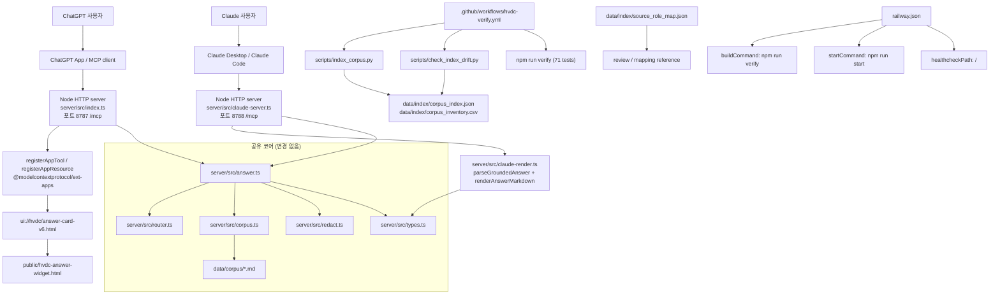

# HVDC Ontology Grounded 시스템 아키텍처

쉽게 말하면, 이 저장소는 ChatGPT App에서 HVDC 물류 질문을 받고, 로컬 온톨로지 corpus 파일에서 근거를 찾은 뒤, MCP HTTP 엔드포인트 `/mcp`로 구조화된 답변과 public widget을 돌려주는 Node 기반 서버입니다.

## 현재 구현 범위

### ChatGPT 레이어 (포트 8787)
- 런타임 서버는 `server/src/index.ts`에 있다.
- MCP HTTP 경로는 `/mcp`이다. 루트 `/`는 Railway healthcheck용 텍스트 응답을 돌려준다.
- MCP 구현은 `@modelcontextprotocol/sdk`의 `McpServer`와 `StreamableHTTPServerTransport`를 사용한다.
- ChatGPT App UI resource는 `@modelcontextprotocol/ext-apps`의 `registerAppResource`로 등록한다.
- UI resource URI는 `ui://hvdc/answer-card-v6.html`이다.
- 실제 HTML 파일은 `public/hvdc-answer-widget.html`이다.

### Claude 레이어 (포트 8788)
- 런타임 서버는 `server/src/claude-server.ts`에 있다.
- 표준 `@modelcontextprotocol/sdk`의 `McpServer.tool()`만 사용한다. `@modelcontextprotocol/ext-apps` 의존 없음.
- `render_hvdc_answer_card`는 마크다운 텍스트를 반환한다. iframe 위젯 없음.
- 포트는 `CLAUDE_PORT` 환경변수 또는 기본 `8788`이다.
- 렌더링은 `server/src/claude-render.ts`가 담당한다. ChatGPT format(`_meta` 포함)과 Claude format(직접 GroundedAnswer) 양쪽을 파싱한다.

### 공유 코어 (변경 없음)
- 답변 근거는 런타임에 `data/corpus/*.md`를 직접 읽어서 만든다.
- `data/index` 파일은 생성/검토용 artifact이며, 현재 검색 런타임의 직접 입력은 `data/corpus`이다.
- Railway 배포는 `railway.json`에 정의된 `npm run verify` 빌드 검증과 `npm run start` 실행 경계 안에 있다.

## 한계와 경계

- 현재 코드에는 ERP, WMS, ATLP, Foundry, WhatsApp, email 발송 같은 외부 운영 시스템 write-back이 없다.
- 현재 코드에는 public web search가 없다.
- 현재 코드에는 SPARQL KG 실행 엔드포인트가 없다.
- 현재 `ask_hvdc_ontology`는 답변 생성 시 `out/audit.jsonl`에 입력/출력 hash와 PII masking 상태를 기록한다.
- 이 감사 로그는 운영 시스템 변경이 아니라 로컬 파일 기록이다.
- Railway 설정은 서버 실행과 healthcheck 경계를 정의한다.
- Railway 설정만으로 외부 데이터 저장소나 운영 시스템 연동이 생기지는 않는다.

## 실행 흐름

## 서버와 MCP 경계

### ChatGPT 서버 (`server/src/index.ts`)

- `createServer`로 Node HTTP 서버를 만든다.
- `/mcp`에서 `POST`, `GET`, `DELETE` 요청을 받는다.
- `OPTIONS /mcp`는 CORS preflight 응답을 돌려준다.
- 요청마다 `createHvdcServer()`로 MCP server instance를 만들고 `StreamableHTTPServerTransport`에 연결한다.
- `enableJsonResponse: true`가 설정되어 있다.
- 루트 `/`는 `"HVDC Ontology ChatGPT App MCP server"` 텍스트를 반환한다.
- 기본 포트는 `PORT` 환경변수가 없으면 `8787`이다.

### Claude 서버 (`server/src/claude-server.ts`)

- ChatGPT 서버와 동일한 Node HTTP 구조를 사용한다.
- 요청마다 `createClaudeServer()`로 MCP server instance를 만든다.
- `McpServer.tool()`만 사용한다. `registerAppTool`, `registerAppResource` 없음.
- 루트 `/`는 `"HVDC Ontology Claude App MCP server"` 텍스트를 반환한다.
- 기본 포트는 `CLAUDE_PORT` 환경변수가 없으면 `8788`이다.
- `HVDC_CLAUDE_TOOL_NAMES` 배열을 export한다 (테스트 parity 검증용).

## 등록된 App tool

ChatGPT 서버(`server/src/index.ts`)와 Claude 서버(`server/src/claude-server.ts`) 모두 동일한 6개 tool 이름을 사용한다.

| Tool | 구현 파일 | ChatGPT 출력 | Claude 출력 |
| --- | --- | --- | --- |
| `ask_hvdc_ontology` | `server/src/answer.ts` | `structuredContent` + text fallback (UI 없음) | `structuredContent` + 마크다운 카드 |
| `render_hvdc_answer_card` | ChatGPT: `server/src/index.ts` Claude: `server/src/claude-render.ts` | `ui://hvdc/answer-card-v6.html` iframe 위젯 | 마크다운 카드 (iframe 없음) |
| `route_question` | `server/src/router.ts` | JSON route | JSON route |
| `search_ontology_corpus` | `server/src/corpus.ts` | `data/corpus` EvidenceSnippet | `data/corpus` EvidenceSnippet |
| `resolve_any_key` | `server/src/router.ts` | identifier 후보 | identifier 후보 |
| `validate_answer` | `server/src/answer.ts` | validation findings | validation findings |

### Claude format 파싱 계약 (`server/src/claude-render.ts`)

`render_hvdc_answer_card`는 두 가지 입력 형식을 모두 수락한다:

| 입력 형식 | 감지 방법 | 처리 |
|---|---|---|
| ChatGPT format | `_meta` 키 존재 | `structuredContent` 추출 후 `ui` 필드 제거 |
| wrapped format | `structuredContent` 존재, `_meta` 없음 | `structuredContent` 추출 후 `ui` 필드 제거 |
| Claude format | 직접 GroundedAnswer 객체 | `ui` 필드만 제거 |

두 형식 모두 같은 마크다운 카드로 출력한다.

## UI resource와 public widget

`server/src/index.ts`는 `public/hvdc-answer-widget.html`을 읽어서 `ui://hvdc/answer-card-v6.html` resource로 등록한다.

- resource 등록은 `registerAppResource`가 담당한다.
- resource MIME type은 `RESOURCE_MIME_TYPE`을 사용한다.
- `ask_hvdc_ontology`는 데이터 전용 tool이다. 답변 JSON과 텍스트 fallback을 반환하지만 UI template metadata를 붙이지 않는다.
- `ask_hvdc_ontology`의 `structuredContent`에는 `ui` 객체를 넣지 않는다. `ui.templateUrl`은 render tool에서만 붙인다.
- `render_hvdc_answer_card` descriptor만 `_meta.ui.resourceUri`와 `_meta["openai/outputTemplate"]`으로 `ui://hvdc/answer-card-v6.html`을 가리킨다.
- 호환성 alias resource는 `ui://hvdc/answer-card-v5.html`와 `ui://hvdc/render_hvdc_answer_card.html`이다.
- `public/hvdc-answer-widget.html`은 verdict, route documents, evidence drawer, validation gate, ontology path를 렌더링한다.
- widget CSS는 긴 action id, protected fields, route reason, validation text가 카드 밖으로 잘리지 않도록 줄바꿈과 responsive grid를 적용한다.
- widget은 자체 fallback text를 가진다.
- widget test는 외부 `fetch()`와 `http(s)://` resource 사용이 없는지 확인한다.

## 핵심 서버 모듈

### `server/src/answer.ts`

답변 pipeline의 중심 파일이다.

- 입력 질문에서 PII를 먼저 masking한다.
- `routeQuestion`으로 required document와 domain을 정한다.
- `loadCorpus`와 `searchCorpus`로 evidence를 찾는다.
- evidence가 질문 token을 충분히 뒷받침하지 않으면 evidence를 비운다.
- `validateGrounding`으로 검증 finding을 만든다.
- finding과 evidence 상태로 verdict를 정한다.
- summary, business impact, details, action recommendation을 만든다.
- identifier 기반 graph path 후보를 만든다.
- `out/audit.jsonl`에 hash 기반 감사 기록을 남긴다.

### `server/src/corpus.ts`

런타임 corpus loader와 검색을 담당한다.

- 기본 corpus 경로는 `data/corpus`이다.
- Markdown 파일을 정렬해서 읽는다.
- 파일마다 `docHash`, `docId`, title, version, domain hint를 만든다.
- Markdown heading 기준으로 section chunk를 만든다.
- 검색은 query term, required docs, domain hints, `CONSOLIDATED-00` 가중치를 사용한다.
- 반환하는 snippet은 PII masking을 거친다.

### `server/src/router.ts`

질문 routing과 any-key 후보 추출을 담당한다.

- 모든 route는 기본으로 `CONSOLIDATED-00-master-ontology`를 포함한다.
- warehouse, document, marine, cost, material, port, communication, operations, compliance domain rule이 있다.
- 매칭 domain이 없으면 operations context로 fallback한다.
- BL, BOE, DO, INVOICE, HVDC_CODE, SITE, MILESTONE pattern을 추출한다.
- Site와 Milestone 후보는 현재 `targetRid`가 `null`이다.

### `server/src/redact.ts`

PII와 token 유사 문자열 masking을 담당한다.

- email을 `[EMAIL_MASKED]`로 바꾼다.
- phone number를 `[PHONE_MASKED]`로 바꾼다.
- token-like 문자열을 `[TOKEN_MASKED]`로 바꾼다.
- `sha256` helper도 이 파일에 있다.

### `server/src/types.ts`

공유 type contract를 정의한다.

- `DomainHint`
- `Verdict`
- `EvidenceSnippet`
- `IntentRoute`
- `ResolvedEntity`
- `GraphPath`
- `ValidationFinding`
- `ActionRecommendation`
- `GroundedAnswer`
- `CorpusChunk`

## 타입/데이터 계약 그래프

아래 그래프는 `server/src/types.ts`에 정의된 TypeScript type contract 기준이다.

## 데이터 흐름

### 런타임 입력

런타임 답변은 `data/corpus/*.md`에서 직접 읽은 Markdown corpus를 기준으로 한다.

현재 `data/corpus`에는 `CONSOLIDATED-00-master-ontology.md`부터 `CONSOLIDATED-09-operations.md`까지의 corpus 문서와 `Team_역할분담_매트릭스.md`가 있다.

### 생성된 index artifact

`scripts/index_corpus.py`는 `data/corpus`를 읽어서 아래 파일을 생성한다.

- `data/index/corpus_index.json`
- `data/index/corpus_inventory.csv`

`scripts/check_index_drift.py`는 생성된 index artifact가 Git diff 기준으로 stale인지 확인한다.

`data/index/source_role_map.json`은 source document의 rank와 role을 담은 수동 mapping reference다.

## 검증과 테스트

현재 package script 기준 검증 명령은 아래와 같다.

- `npm run typecheck`: TypeScript typecheck를 실행한다.
- `npm test`: Vitest test를 실행한다.
- `npm run verify`: typecheck와 test를 순서대로 실행한다.
- `npm run index`: corpus index artifact를 다시 만든다.
- `npm run claude:dev`: Claude 서버를 개발 모드로 실행한다.
- `npm run claude:start`: Claude 서버를 시작한다.

현재 test 파일은 아래 역할을 가진다. **총 71개 테스트 통과** (2026-05-11 기준).

| Test file | 테스트 수 | 확인하는 내용 |
| --- | --- | --- |
| `tests/pipeline.test.ts` | 11 | AGI/DAS M130 block, Flow Code WHP-only, currentness warning, PII masking을 확인한다. |
| `tests/evals.test.ts` | 15 | `tests/golden_prompts.json`의 golden prompt별 verdict, rule, required docs, evidence 조건을 확인한다. |
| `tests/descriptor.test.ts` | 8 | server tool descriptor와 `chatgpt-app-submission.json` tool 목록 및 annotation parity를 확인한다. |
| `tests/widget.test.ts` | 9 | public widget의 section 순서, evidence fields, fallback/accessibility, 외부 fetch/resource 부재를 확인한다. |
| `tests/claude-descriptor.test.ts` | 28 | Claude tool parity, `parseGroundedAnswer` 양방향 포맷 파싱, `renderAnswerMarkdown` 필수 필드를 확인한다. |

## GitHub Actions

`.github/workflows/hvdc-verify.yml`은 push, pull request, manual dispatch에서 검증을 실행한다.

검증 job은 아래 순서로 동작한다.

1. repository checkout
2. Node.js 20 setup
3. Python 3.12 setup
4. `npm ci`
5. `npm run index`
6. `python scripts/check_index_drift.py`
7. `python -m json.tool chatgpt-app-submission.json > /dev/null`
8. `npm run verify`

## Railway 배포 경계

`railway.json` 기준 Railway는 아래만 정의한다.

- build builder: `RAILPACK`
- build command: `npm run verify`
- start command: `npm run start`
- healthcheck path: `/`
- healthcheck timeout: `60`
- restart policy: `ON_FAILURE`
- max retries: `3`

따라서 Railway 배포 경계는 Node MCP server 실행과 root healthcheck 확인까지다.
이 설정은 외부 운영 시스템 연결이나 데이터 write-back을 추가하지 않는다.

## 현재 아키텍처 판정

이 저장소의 현재 아키텍처는 **ChatGPT + Claude 듀얼 레이어 corpus-only MCP App MVP**다.

- **ChatGPT 레이어**: `server/src/index.ts`가 포트 8787에서 `/mcp`를 열고, `@modelcontextprotocol/ext-apps`의 `registerAppTool`로 ChatGPT App tool descriptor를 등록한다. `render_hvdc_answer_card`는 `ui://hvdc/answer-card-v6.html` iframe 위젯을 연결한다.
- **Claude 레이어**: `server/src/claude-server.ts`가 포트 8788에서 `/mcp`를 열고, 표준 `McpServer.tool()`로 동일한 6개 tool을 등록한다. `render_hvdc_answer_card`는 마크다운 카드를 반환한다. `server/src/claude-render.ts`가 ChatGPT/Claude 양방향 포맷을 파싱한다.
- **공유 코어**: `answer.ts`, `corpus.ts`, `router.ts`, `redact.ts`, `types.ts`는 두 서버가 변경 없이 공유한다.
- **GitHub Actions와 Railway**: 같은 `npm run verify` 검증 경계를 공유한다. Railway 배포 경계는 ChatGPT 서버(`npm run start`)이다.
