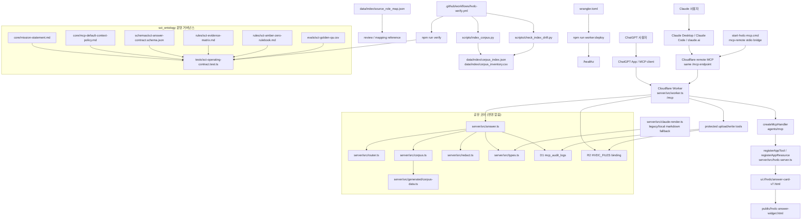
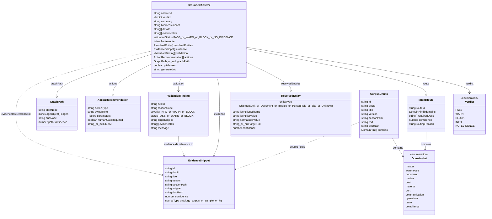

# HVDC Ontology Grounded 시스템 아키텍처

쉽게 말하면, 이 저장소는 ChatGPT App에서 HVDC 물류 질문을 받고, Worker 번들에 포함된 온톨로지 corpus에서 근거를 찾은 뒤, Cloudflare Workers MCP HTTP 엔드포인트 `/mcp`로 구조화된 답변과 public widget을 돌려주는 서버입니다.

## 현재 구현 범위

### 2026-05-14 운영 기준

현재 공개 런타임은 Cloudflare Workers remote MCP이다.

| 구성 | 현재 상태 | 증거 |
|---|---|---|
| Worker | `hvdc-ontology-chatgpt-app` | `/healthz`에서 `service=hvdc-ontology-chatgpt-app`, `runtime=cloudflare-workers` 확인 |
| MCP path | `/mcp` | remote MCP `initialize`와 `tools/list` 확인 |
| Tool inventory | 15개 tool | 기존 read/validation 6개, protected upload/write 5개, Dual-MCP analysis 4개 확인 |
| Storage | Cloudflare R2 + D1 | `/healthz`에서 `r2=true`, `d1Audit=true` 확인. remote D1 migration `0003_dual_mcp_tables.sql` 적용 완료 |
| Auth | upload/write 보호 활성 | `/healthz`에서 `protectedWriteTools=true`, `tokenConfigured=true` 확인 |
| Deployment | Cloudflare Worker deployed | Version ID `15472eac-2698-4d9f-94e9-a7fa344f1fd8` |
| Verification | current local release gate pass | `npm run verify`에서 10 files / 150 tests 통과, `wrangler deploy --dry-run` 통과 |

`ontology-insight-upgrade/`는 로컬 Python/Fuseki 참조 구현이다. 이 폴더의 Phase 1~5 산출물과 README 정직성 패치는 GitHub에 들어갔지만, 그 자체가 Cloudflare Worker에 `invoice_risk_scan`이나 Fuseki bridge가 배포됐다는 뜻은 아니다.

### ChatGPT 레이어 (Cloudflare Workers)
- 런타임 서버는 `server/src/worker.ts`에 있다.
- MCP HTTP 경로는 `/mcp`이다. 루트 `/`와 `/healthz`는 Cloudflare health response를 돌려준다.
- MCP 구현은 `agents/mcp`의 `createMcpHandler`와 `@modelcontextprotocol/sdk`의 `McpServer`를 사용한다.
- ChatGPT App UI resource는 `server/src/hvdc-server.ts`에서 `@modelcontextprotocol/ext-apps`의 `registerAppResource`로 등록한다.
- UI resource URI는 `ui://hvdc/answer-card-v7.html`이다.
- 실제 HTML 파일은 `public/hvdc-answer-widget.html`이다.

### Claude 레이어 (Cloudflare 원격 MCP)
- Claude Code, Claude Desktop, claude.ai는 모두 Cloudflare Workers 원격 MCP `https://hvdc-ontology-chatgpt-app.mscho715.workers.dev/mcp`를 사용한다.
- `.mcp.json`, `C:\Users\jichu\.claude\settings.json`, `C:\Users\jichu\AppData\Roaming\Claude\claude_desktop_config.json`은 같은 HTTP URL을 가리킨다.
- `start-hvdc-mcp.cmd`는 로컬 Claude 서버가 아니라 `mcp-remote` stdio bridge로 Cloudflare MCP에 연결한다.
- `server/src/claude-server.ts`와 `server/src/claude-render.ts`는 기존 포맷 호환과 테스트용 로컬 fallback이다. 운영 연결 기준은 아니다.

### 공유 코어
- 답변 근거는 `scripts/generate_worker_assets.py`가 만든 `server/src/generated/corpus-data.ts`에서 읽는다.
- `data/corpus`는 승인 corpus 원본이고, Worker 배포 전 generated module로 번들링한다.
- FMC 역할 분석 corpus는 사람, 담당자, 에스컬레이션, milestone owner 질문의 evidence source다. 이 문서는 `CONSOLIDATED-00-master-ontology`와 함께 조회하며 개인 이름을 canonical ontology class로 승격하지 않는다.
- `data/index` 파일은 생성/검토용 artifact이며, 검색 런타임의 직접 입력은 generated corpus module이다.
- Cloudflare 배포는 `wrangler.toml`과 `npm run worker:deploy` 경계 안에 있다.

### sct_ontology 운영 거버넌스 레이어
- `core/mission-statement.md`와 `core/mcp-default-context-policy.md`는 팀 표준 LLM 운영 목적과 기본 HVDC logistics context 정책을 정의한다.
- `schemas/sct-answer-contract.schema.json`은 governance 수준의 answer contract를 정의한다.
- `rules/sct-evidence-matrix.md`와 `rules/sct-amber-zero-rulebook.md`는 evidence requirement와 AMBER/ZERO gate를 정의한다.
- `evals/sct-golden-qa.csv`는 팀 답변 일관성을 검증하는 Golden Q&A seed다.
- 이 레이어는 runtime corpus가 아니다. `data/corpus/`에 넣거나 runtime evidence로 쓰려면 별도 승인된 phase가 필요하다.

## 한계와 경계

- 현재 코드에는 ERP, WMS, ATLP, Foundry, WhatsApp, email 발송 같은 외부 운영 시스템 write-back이 없다.
- 현재 코드에는 public web search가 없다.
- 현재 코드에는 SPARQL KG 실행 엔드포인트가 없다.
- Cloudflare 운영 `ask_hvdc_ontology`는 D1 `mcp_audit_logs`에 입력/출력 hash와 PII masking 상태를 기록한다.
- Node fallback 실행은 `out/audit.jsonl`에 같은 hash 기반 감사 로그를 남긴다.
- R2/D1 바인딩은 보호된 upload/write tool의 관리 저장소다. 이 tool들은 OAuth Bearer scope와 Human-gate approval이 없으면 실패한다.
- 보호된 upload/write tool은 Cloudflare R2/D1 내부의 `uploads/`, `writes/proposals/`, `managed/` 경로와 D1 metadata만 변경한다.
- Cloudflare 설정만으로 ERP, WMS, ATLP, Foundry 같은 외부 운영 시스템 write-back이 생기지는 않는다.

## 실행 흐름

## 서버와 MCP 경계

### ChatGPT 서버 (`server/src/worker.ts`)

- Cloudflare Worker `fetch()`가 `/mcp`, `/`, `/healthz`를 처리한다.
- `/mcp`에서 `POST`, `GET`, `DELETE`, `OPTIONS` 요청을 받는다.
- 요청마다 `createHvdcServer()`로 MCP server instance를 만들고 `agents/mcp`의 `createMcpHandler`에 연결한다.
- `enableJsonResponse: true`가 설정되어 있다.
- 루트 `/`와 `/healthz`는 runtime, storage binding, widget domain 상태를 JSON으로 반환한다.
- Node fallback은 `server/src/index.ts`이며 `npm run node:dev`로 실행한다.

### Claude bridge와 fallback

- Claude 운영 연결은 Cloudflare Worker `/mcp`를 직접 HTTP로 사용한다.
- HTTP MCP를 직접 지원하지 않는 stdio client는 `start-hvdc-mcp.cmd`를 실행한다.
- `start-hvdc-mcp.cmd`는 `mcp-remote https://hvdc-ontology-chatgpt-app.mscho715.workers.dev/mcp`를 실행한다.
- `server/src/claude-server.ts`는 legacy/local fallback과 `HVDC_CLAUDE_TOOL_NAMES` parity 테스트용으로 유지한다.

## 등록된 App tool

Cloudflare Worker(`server/src/worker.ts` + `server/src/hvdc-server.ts`)와 Claude bridge가 동일한 15개 tool 이름을 사용한다.

| Tool | 구현 파일 | ChatGPT 출력 | Claude 출력 |
| --- | --- | --- | --- |
| `ask_hvdc_ontology` | `server/src/answer.ts` | `structuredContent` + answer card template metadata | Cloudflare MCP text/structured result |
| `render_hvdc_answer_card` | Cloudflare: `server/src/hvdc-server.ts` Legacy local: `server/src/claude-render.ts` | `ui://hvdc/answer-card-v7.html` iframe 위젯 | Cloudflare MCP text/structured result 또는 legacy markdown fallback |
| `route_question` | `server/src/router.ts` | JSON route | JSON route |
| `search_ontology_corpus` | `server/src/corpus.ts` | generated corpus EvidenceSnippet | generated corpus EvidenceSnippet |
| `resolve_any_key` | `server/src/router.ts` | identifier 후보 | identifier 후보 |
| `validate_answer` | `server/src/answer.ts` | validation findings | validation findings |
| `create_upload_url` | `server/src/hvdc-server.ts`, `server/src/worker.ts` | OAuth Bearer + Human-gate 후 R2 upload URL | Cloudflare MCP structured result 또는 local fallback `AUTH_REQUIRED` |
| `complete_upload` | `server/src/hvdc-server.ts`, `server/src/worker.ts` | R2 upload metadata 확인 | Cloudflare MCP structured result 또는 local fallback `AUTH_REQUIRED` |
| `attach_uploaded_file` | `server/src/hvdc-server.ts`, `server/src/worker.ts` | D1 attachment metadata 작성 | Cloudflare MCP structured result 또는 local fallback `AUTH_REQUIRED` |
| `write_file_dry_run` | `server/src/hvdc-server.ts`, `server/src/worker.ts` | R2/D1 managed write proposal 작성 | Cloudflare MCP structured result 또는 local fallback `AUTH_REQUIRED` |
| `write_file_commit` | `server/src/hvdc-server.ts`, `server/src/worker.ts` | 승인된 proposal을 R2 `managed/`에 commit | Cloudflare MCP structured result 또는 local fallback `AUTH_REQUIRED` |
| `check_cost_guard` | `server/src/cost-guard.ts` | invoice line Δ%, band, Human-gate 판단 | Cloudflare MCP structured result |
| `check_mosb_gate` | `server/src/mosb-gate.ts` | AGI/DAS MOSB milestone chain gate | Cloudflare MCP structured result |
| `check_doc_guardian` | `server/src/doc-guardian.ts` | CI/BL/PL/DO 교차 정합성 검증 | Cloudflare MCP structured result |
| `get_team_actions` | `server/src/team-action-router.ts` | milestone/domain 기반 role action routing | Cloudflare MCP structured result |

### Claude format 파싱 계약 (`server/src/claude-render.ts`)

`render_hvdc_answer_card`는 두 가지 입력 형식을 모두 수락한다:

| 입력 형식 | 감지 방법 | 처리 |
|---|---|---|
| ChatGPT format | `_meta` 키 존재 | `structuredContent` 추출 후 `ui` 필드 제거 |
| wrapped format | `structuredContent` 존재, `_meta` 없음 | `structuredContent` 추출 후 `ui` 필드 제거 |
| Claude format | 직접 GroundedAnswer 객체 | `ui` 필드만 제거 |

두 형식 모두 같은 마크다운 카드로 출력한다.

## UI resource와 public widget

`server/src/hvdc-server.ts`는 generated widget module을 읽어서 `ui://hvdc/answer-card-v7.html` resource로 등록한다.

- resource 등록은 `registerAppResource`가 담당한다.
- resource MIME type은 `RESOURCE_MIME_TYPE`을 사용한다.
- `ask_hvdc_ontology`는 답변 JSON과 텍스트 fallback을 반환하고, ChatGPT 카드 표시를 위해 tool/result metadata로 `ui://hvdc/answer-card-v7.html`을 가리킨다.
- `ask_hvdc_ontology`의 `structuredContent`에는 `ui` 객체를 넣지 않는다. `ui.templateUrl`은 render tool에서만 붙인다.
- `render_hvdc_answer_card` descriptor도 `_meta.ui.resourceUri`와 `_meta["openai/outputTemplate"]`으로 `ui://hvdc/answer-card-v7.html`을 가리킨다.
- 사용자에게 보이는 최종 HVDC 답변은 `ask_hvdc_ontology` 한 번으로 카드 표시까지 시도한다. `render_hvdc_answer_card`는 이미 준비된 답변을 명시적으로 다시 렌더링할 때 사용한다.
- 호환성 alias resource는 `ui://hvdc/answer-card-v6.html`, `ui://hvdc/answer-card-v5.html`, `ui://hvdc/render_hvdc_answer_card.html`이다.
- `public/hvdc-answer-widget.html`은 verdict, route documents, evidence drawer, validation gate, ontology path를 렌더링한다.
- widget CSS는 긴 action id, protected fields, route reason, validation text가 카드 밖으로 잘리지 않도록 줄바꿈과 responsive grid를 적용한다.
- widget은 자체 fallback text를 가진다.
- widget test는 외부 `fetch()`와 `http(s)://` resource 사용이 없는지 확인한다.

## 핵심 서버 모듈

### `server/src/answer.ts`

답변 pipeline의 중심 파일이다.

- 입력 질문에서 PII를 먼저 masking한다.
- `routeQuestion`으로 required document와 domain을 정한다.
- `loadCorpus`와 `searchCorpus`로 evidence를 찾는다.
- evidence가 질문 token을 충분히 뒷받침하지 않으면 evidence를 비운다.
- `validateGrounding`으로 검증 finding을 만든다.
- finding과 evidence 상태로 verdict를 정한다.
- summary, business impact, details, action recommendation을 만든다.
- identifier 기반 graph path 후보를 만든다.
- `out/audit.jsonl`에 hash 기반 감사 기록을 남긴다.

### `server/src/corpus.ts`

런타임 corpus loader와 검색을 담당한다.

- 기본 corpus 경로는 `data/corpus`이다.
- Markdown 파일을 정렬해서 읽는다.
- 파일마다 `docHash`, `docId`, title, version, domain hint를 만든다.
- Markdown heading 기준으로 section chunk를 만든다.
- 검색은 query term, required docs, domain hints, `CONSOLIDATED-00` 가중치를 사용한다.
- 반환하는 snippet은 PII masking을 거친다.

### `server/src/router.ts`

질문 routing과 any-key 후보 추출을 담당한다.

- 모든 route는 기본으로 `CONSOLIDATED-00-master-ontology`를 포함한다.
- warehouse, document, marine, cost, material, port, communication, operations, team, compliance domain rule이 있다.
- team rule은 `HVDC_FMC_Role_Analysis_FINAL_10x_2026-04-27.combined`를 required doc으로 추가한다.
- 매칭 domain이 없으면 operations context로 fallback한다.
- BL, BOE, DO, INVOICE, HVDC_CODE, SITE, MILESTONE pattern을 추출한다.
- Site와 Milestone 후보는 현재 `targetRid`가 `null`이다.

### Dual-MCP 엔진 모듈

Dual-MCP 엔진은 운영 source of truth를 직접 바꾸지 않는다. 각 tool은 evidence-backed 검증 결과와 ActionProposal만 반환한다.

| Module | Tool | 역할 |
|---|---|---|
| `server/src/cost-guard.ts` | `check_cost_guard` | 인보이스 line 금액, 표준금액 대비 Δ%, band, Human-gate를 계산한다. |
| `server/src/mosb-gate.ts` | `check_mosb_gate` | AGI/DAS 행선지에서 M115/M116/M117/M130 chain과 승인 예외를 확인한다. |
| `server/src/doc-guardian.ts` | `check_doc_guardian` | 문서 간 수량, 중량, 컨테이너 번호 불일치를 찾는다. |
| `server/src/team-action-router.ts` | `get_team_actions` | milestone과 domain을 owner role, backup role, required evidence로 연결한다. |

### `server/src/redact.ts`

PII와 token 유사 문자열 masking을 담당한다.

- email을 `[EMAIL_MASKED]`로 바꾼다.
- phone number를 `[PHONE_MASKED]`로 바꾼다.
- token-like 문자열을 `[TOKEN_MASKED]`로 바꾼다.
- `sha256` helper도 이 파일에 있다.

### `server/src/types.ts`

공유 type contract를 정의한다.

- `DomainHint`
- `Verdict`
- `EvidenceSnippet`
- `IntentRoute`
- `ResolvedEntity`
- `GraphPath`
- `ValidationFinding`
- `ActionRecommendation`
- `GroundedAnswer`
- `CorpusChunk`

## 타입/데이터 계약 그래프

아래 그래프는 `server/src/types.ts`에 정의된 TypeScript type contract 기준이다.

## 데이터 흐름

### 런타임 입력

런타임 답변은 `server/src/generated/corpus-data.ts`에 번들된 Markdown corpus section을 기준으로 한다.

현재 `data/corpus`에는 `CONSOLIDATED-00-master-ontology.md`부터 `CONSOLIDATED-09-operations.md`까지의 corpus 문서, `Team_역할분담_매트릭스.md`, `HVDC_FMC_Role_Analysis_FINAL_10x_2026-04-27.combined.md`가 있다. `scripts/generate_worker_assets.py`가 이 원본을 Worker용 TypeScript 모듈로 만든다.

### 생성된 index artifact

`scripts/index_corpus.py`는 `data/corpus`를 읽어서 아래 파일을 생성한다.

- `data/index/corpus_index.json`
- `data/index/corpus_inventory.csv`

`scripts/check_index_drift.py`는 생성된 index artifact가 Git diff 기준으로 stale인지 확인한다.

`data/index/source_role_map.json`은 source document의 rank와 role을 담은 수동 mapping reference다.

## 검증과 테스트

현재 package script 기준 검증 명령은 아래와 같다.

- `npm run typecheck`: TypeScript typecheck를 실행한다.
- `npm test`: Vitest test를 실행한다.
- `npm run verify`: generated asset 생성, typecheck, Vitest, Worker dry-run을 순서대로 실행한다.
- `npm run index`: corpus index artifact를 다시 만든다.
- `npm run claude:dev`: Cloudflare remote MCP로 연결하는 `mcp-remote` bridge를 실행한다.
- `npm run claude:start`: Cloudflare remote MCP로 연결하는 `mcp-remote` bridge를 실행한다.
- `npm run claude:local`: legacy/local Claude fallback 서버를 실행한다.

현재 test 파일은 아래 역할을 가진다. **총 150개 테스트 통과** (2026-05-14 `npm run verify` 기준).

| Test file | 테스트 수 | 확인하는 내용 |
| --- | --- | --- |
| `tests/pipeline.test.ts` | 25 | AGI/DAS M130 block, Flow Code WHP-only, currentness warning, PII masking을 확인한다. |
| `tests/evals.test.ts` | 17 | `tests/golden_prompts.json`의 golden prompt별 verdict, rule, required docs, evidence 조건을 확인한다. |
| `tests/fmc-role-corpus.test.ts` | 5 | FMC 역할 분석 corpus가 사람·담당자·milestone owner 질문에서 검색되는지 확인한다. |
| `tests/descriptor.test.ts` | 12 | server tool descriptor와 `chatgpt-app-submission.json` tool 목록 및 annotation parity를 확인한다. |
| `tests/write-upload-tools.test.ts` | 2 | OAuth Bearer 보호 upload/write tool의 fail-closed와 승인된 dry-run/commit 경로를 확인한다. |
| `tests/dual-mcp.test.ts` | 30 | CostGuard, MOSB Gate, Document Guardian, Team Action Router의 정상/경계/차단 규칙을 확인한다. |
| `tests/widget.test.ts` | 14 | public widget의 section 순서, evidence fields, fallback/accessibility, 외부 fetch/resource 부재를 확인한다. |
| `tests/claude-descriptor.test.ts` | 29 | Claude tool parity, `parseGroundedAnswer` 양방향 포맷 파싱, `renderAnswerMarkdown` 필수 필드를 확인한다. |
| `tests/sct-operating-contract.test.ts` | 6 | SCT 운영 계약을 확인한다. |
| `tests/sct-governance-runtime.test.ts` | 10 | SCT governance runtime 경계를 확인한다. |

## GitHub Actions

`.github/workflows/hvdc-verify.yml`은 push, pull request, manual dispatch에서 검증을 실행한다.

검증 job은 아래 순서로 동작한다.

1. repository checkout
2. Node.js 20 setup
3. Python 3.12 setup
4. `npm ci`
5. `npm run index`
6. `python scripts/check_index_drift.py`
7. `python -m json.tool chatgpt-app-submission.json > /dev/null`
8. `npm run verify`

## Cloudflare 배포 경계

`wrangler.toml` 기준 Cloudflare는 아래를 정의한다.

- Worker entrypoint: `server/src/worker.ts`
- MCP path: `/mcp`
- compatibility date: `2026-05-13`
- compatibility flag: `nodejs_compat`
- R2 binding: `HVDC_FILES`
- D1 binding: `MCP_AUDIT_DB`
- health path: `/healthz`

따라서 Cloudflare 배포 경계는 Worker MCP server 실행, R2/D1 binding 연결, health response 확인까지다.
이 설정은 외부 운영 시스템 연결이나 업무 데이터 write-back을 추가하지 않는다.

## 현재 아키텍처 판정

이 저장소의 현재 아키텍처는 **Cloudflare Workers/R2/D1 remote MCP + Claude/Cursor/ChatGPT 공통 Cloudflare 연결**이다.

- **ChatGPT 레이어**: `server/src/worker.ts`가 Cloudflare Workers에서 `/mcp`를 열고, `server/src/hvdc-server.ts`가 `@modelcontextprotocol/ext-apps`의 `registerAppTool`로 ChatGPT App tool descriptor를 등록한다. `render_hvdc_answer_card`는 `ui://hvdc/answer-card-v7.html` iframe 위젯을 연결한다.
- **Claude 레이어**: Claude Code, Claude Desktop, claude.ai는 같은 Cloudflare Worker `/mcp`에 연결한다. stdio만 지원하는 경로는 `start-hvdc-mcp.cmd`가 `mcp-remote`로 Cloudflare에 프록시한다.
- **공유 코어**: `answer.ts`, `corpus.ts`, `router.ts`, `redact.ts`, `types.ts`는 두 서버가 공유한다.
- **GitHub Actions와 Cloudflare**: `npm run verify`가 generated worker assets, typecheck, tests, Worker dry-run을 같은 검증 경계로 묶는다. Cloudflare 배포 경계는 `npm run worker:deploy`이다.

## Evidence Trace Mode architecture addendum - 2026-05-11

이 추가 섹션은 기존 아키텍처 설명을 지우지 않고, Evidence Trace Mode 이후의 최신 데이터 흐름을 덧붙입니다.

### Answer contract

`GroundedAnswer` now includes `evidenceTrace`.
Each trace item links one visible answer statement to the evidence IDs that support it.

Trace item fields:
- `targetType`
- `targetIndex`
- `answerText`
- `supportState`
- `evidenceIds`

Allowed support states:
- `SUPPORTED`
- `NO_DIRECT_EVIDENCE`

Trace targets:
- `summary`
- `businessImpact`
- `details`
- `actions`

### Shared core flow

`server/src/answer.ts` builds the grounded answer first.
It then builds trace entries from the answer text and the same returned evidence set.
Trace references must stay inside the answer's returned `evidenceIds`.

Action trace entries can stay `NO_DIRECT_EVIDENCE`.
This is expected when the action is a workflow recommendation rather than a directly supported corpus statement.

### ChatGPT layer flow

`ask_hvdc_ontology` returns answer data and ChatGPT card template metadata.
It can return `evidenceTrace`, but it does not attach `structuredContent.ui`.

`render_hvdc_answer_card` accepts trace data for presentation.
If old render input omits `evidenceTrace`, the server treats it as `[]`.

`public/hvdc-answer-widget.html` renders:
- trace chips next to answer statements
- short display labels such as `E1`
- `No direct evidence` for unsupported statements
- raw evidence IDs in the Evidence Drawer
- connected answer statements for each drawer evidence item

UI trace failures are presentation failures only.
They must not change `verdict`, `validationStatus`, `evidenceIds`, `actions`, or other business result fields.

### Claude layer flow

`server/src/claude-render.ts` accepts ChatGPT format, wrapped format, and direct `GroundedAnswer` format.
It strips UI-only fields before rendering markdown.
It treats missing `evidenceTrace` as an empty array.
Claude markdown now includes an `Evidence Trace` section with supported labels and `No direct evidence` status.

### Verification coverage

Evidence Trace Mode is covered by:
- `tests/pipeline.test.ts` for supported trace, no-direct-evidence trace, and blocked-answer preservation.
- `tests/widget.test.ts` for trace chips, raw evidence IDs, connected statements, `No direct evidence`, and external fetch blocking.
- `tests/descriptor.test.ts` for legacy render input compatibility.
- `tests/claude-descriptor.test.ts` for markdown trace rendering.

Latest observed local verification:
- Command: `npm run verify`
- Result: TypeScript check passed, and Vitest passed 5 test files with 78 tests.

### Architecture boundary

Evidence Trace Mode is an explanation layer.
It is not a confidence scoring engine, live KG lineage system, ERP mutation trail, or external report approval mechanism.
