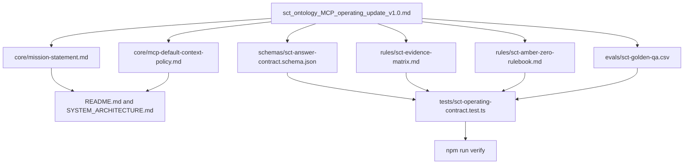
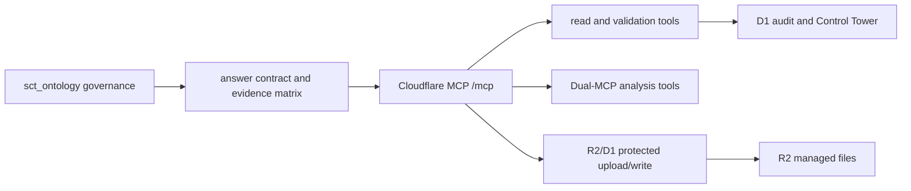

# Plan: sct_ontology MCP Operating Update v1.0

Created: 2026-05-11
Status: Phase 2 implemented and locally verified
Source: `sct_ontology_MCP_operating_update_v1.0.md`
Scope: Convert the operating update into an implementable governance and regression plan for the SCT_ONTOLOGY MCP layer.

## Phase 1: Business Review

### 1.1 Problem Definition

Current state: SCT_ONTOLOGY already has an MCP app, corpus-grounded answer rules, Phase 3 regression gates, GitHub Actions, and Cloudflare Workers deployment target, but the new operating update is not yet mapped into repo governance files, schemas, rulebooks, evals, or approval gates.

Target state: `sct_ontology` becomes the documented team-standard LLM operating layer with a fixed mission statement, default HVDC logistics context policy, answer contract, evidence matrix, AMBER/ZERO rulebook, Golden Q&A eval, and governance checks.

Quantified impact scope:

- Source document to operationalize: 1 file
  - `sct_ontology_MCP_operating_update_v1.0.md`
- Proposed new governance/runtime-support files: 6 files
  - `core/mission-statement.md`
  - `core/mcp-default-context-policy.md`
  - `schemas/sct-answer-contract.schema.json`
  - `rules/sct-evidence-matrix.md`
  - `rules/sct-amber-zero-rulebook.md`
  - `evals/sct-golden-qa.csv`
- Existing repo alignment files likely touched: 4-6 files
  - `AGENTS.md`
  - `README.md`
  - `SYSTEM_ARCHITECTURE.md`
  - `CHANGELOG.md`
  - `tests/descriptor.test.ts`
  - `tests/pipeline.test.ts` or a new eval test file
- Acceptance targets from source:
  - Answer Contract compliance: 100.00%
  - Golden Q&A verdict match: at least 95.00%
  - High-risk ZERO recall: 100.00%
  - Hallucination incident: 0.00
  - Audit log coverage: 100.00%

### 1.2 Proposed Options

| Option | Description | Effort (days) | Risk | Cost (AED) |
|---|---|---:|---|---:|
| A | Documentation-only adoption. Add the six P1 files and link them from existing docs. No schema/eval enforcement yet. | 1 | Low technical risk, but weak enforcement and easy drift. | 0 |
| B | Governance + regression adoption. Add the six P1 files, wire them into tests, and add Golden Q&A / AMBER-ZERO checks as CI-visible regression gates. | 2 | Moderate scope, best fit for team standardization and existing Phase 3 gates. | 0 |
| C | Runtime-first adoption. Add the six P1 files and immediately make `ask_hvdc_ontology` enforce the full evidence matrix and AMBER/ZERO gate at answer time. | 3-4 | Higher blast radius; may change answer behavior before the operating rules are reviewed. | 0 |

### 1.3 Recommendation & Rationale

Recommended option: B.

Reason 1: It turns the operating update into enforceable repo governance without immediately changing production answer behavior.
Reason 2: It matches the existing SCT_ONTOLOGY pattern: document the contract, add deterministic tests, then expand runtime behavior only when evidence is stable.
Reason 3: It gives the team a measurable path to the stated targets: 100.00% answer contract compliance, 95.00%+ Golden Q&A verdict match, and 100.00% high-risk ZERO recall.

Rollback strategy: Revert the new P1 governance files and their tests while leaving the existing MCP runtime, Phase 3 regression gates, and Cloudflare deployment target unchanged.

### 1.4 Approval Request

- [x] Phase 1 승인

Approval basis: user replied `승인`.

## Phase 2: Engineering Review

### 2.1 Mermaid Diagram

### 2.2 File Change List

| File | Change Type | Description |
|---|---|---|
| `core/mission-statement.md` | create | Record the official mission: reduce hallucination, inject MR.CHA HVDC logistics knowledge, and standardize team LLM usage. |
| `core/mcp-default-context-policy.md` | create | Define default HVDC logistics context routing unless the user explicitly asks for a general answer. |
| `schemas/sct-answer-contract.schema.json` | create | Define the required answer structure for verdict, evidence, gate, action, audit, and owner fields. |
| `rules/sct-evidence-matrix.md` | create | Convert the source Evidence Matrix into required evidence and missing-evidence gate rules by domain. |
| `rules/sct-amber-zero-rulebook.md` | create | Define AMBER/ZERO gates and high-risk stop conditions for customs, cost, DEM/DET, ETA, warehouse, OOG/safety, and claim cases. |
| `evals/sct-golden-qa.csv` | create | Add team-standard Golden Q&A rows for verdict regression and high-risk ZERO recall checks. |
| `tests/sct-operating-contract.test.ts` | create | Validate P1 files exist, schema is parseable, required domains/gates are present, and Golden Q&A rows meet minimum structure. |
| `README.md` | modify | Link the new operating layer files and explain the intended team use. |
| `SYSTEM_ARCHITECTURE.md` | modify | Add the operating governance layer to the architecture overview. |
| `AGENTS.md` | modify | Add a short development rule pointing to the new operating contract files as governance evidence. |
| `CHANGELOG.md` | modify | Record the operating update, verification command, and limits. |

Create-file collision check:

- `core/` does not exist at planning time.
- `schemas/` does not exist at planning time.
- `rules/` does not exist at planning time.
- `evals/` does not exist at planning time.
- `tests/sct-operating-contract.test.ts` does not exist at planning time.
- If any of these paths appear during execution, inspect and patch the existing file. Do not silently create alternate names.

### 2.3 Dependencies & Order

1. Create the governance directories and six P1 source files.
2. Create `schemas/sct-answer-contract.schema.json` before writing schema validation tests.
3. Create `rules/sct-evidence-matrix.md` and `rules/sct-amber-zero-rulebook.md` before Golden Q&A expectations.
4. Create `evals/sct-golden-qa.csv` after the evidence matrix and gate rulebook are stable.
5. Add `tests/sct-operating-contract.test.ts` to validate file presence, parseability, required domains, required gates, and Golden Q&A structure.
6. Update `README.md`, `SYSTEM_ARCHITECTURE.md`, `AGENTS.md`, and `CHANGELOG.md` after the P1 files exist.
7. Run focused test for `tests/sct-operating-contract.test.ts`.
8. Run `npm run verify`.

Parallel paths:

- Path A: `core/mission-statement.md` and `core/mcp-default-context-policy.md` can be drafted independently.
- Path B: `rules/sct-evidence-matrix.md` and `rules/sct-amber-zero-rulebook.md` can be drafted independently but must use the same domain names.
- Path C: `schemas/sct-answer-contract.schema.json` can be drafted independently, then wired into tests.
- Merge point: `tests/sct-operating-contract.test.ts` must validate all P1 files together.

Shared modules:

- `AGENTS.md`, `README.md`, and `SYSTEM_ARCHITECTURE.md` are shared documentation surfaces. Patch them after the new files are stable.
- No runtime source file should change in this plan unless the owner explicitly upgrades Option B to Option C.

### 2.4 Test Strategy

Unit-style document contract tests:

- `tests/sct-operating-contract.test.ts` verifies all six P1 files exist.
- The schema test parses `schemas/sct-answer-contract.schema.json` as JSON.
- The evidence matrix test checks all required domains: Customs, Cost, DEM/DET, ETA, Warehouse, OOG/Safety, and Claim.
- The AMBER/ZERO test checks both `AMBER` and `ZERO` gates are present and that high-risk domains have gate language.
- The Golden Q&A test parses CSV rows and verifies required columns such as `id`, `question`, `expectedVerdict`, `requiredEvidence`, and `riskDomain`.

Integration tests:

- No live API or production system integration is required for Option B.
- Existing `npm run verify` remains the full regression gate.
- If runtime enforcement is later approved, add separate pipeline tests before changing `answer.ts`.

Existing tests most likely to catch breakage:

- `tests/descriptor.test.ts`: MCP tool contract and data/render separation.
- `tests/pipeline.test.ts`: answer verdict, evidence, validation, and action behavior.
- `tests/evals.test.ts`: existing golden prompt behavior.
- `tests/widget.test.ts`: UI display and evidence trace rendering.

### 2.5 Risks & Mitigations

Performance risk:

- Risk: New tests may slow CI if they become large file scans.
- Mitigation: Keep the operating contract test limited to six P1 files and one CSV.

Compatibility risk:

- Risk: Governance files may imply runtime behavior that is not yet implemented.
- Mitigation: Mark Option B as governance + regression adoption only. Do not claim runtime enforcement until Option C is approved and tested.

Security risk:

- Risk: Golden Q&A rows or examples could include sensitive operational data.
- Mitigation: Use sanitized fixture identifiers and avoid phone numbers, emails, private URLs, credentials, or commercial secrets.

Governance risk:

- Risk: New `core/`, `rules/`, `schemas/`, and `evals/` directories may overlap with future ontology corpus directories.
- Mitigation: Document these as governance/eval assets, not runtime corpus sources, unless a later phase explicitly indexes them.

Blast-radius risk:

- Risk: Editing `AGENTS.md` can change future agent behavior broadly.
- Mitigation: Keep the AGENTS change short and reference-only; do not redefine existing product rules.

### 2.6 Approval Point Before Implementation

- [x] Phase 2 실행 승인

Approval basis: user replied `Phase 2 실행 승인`.

## Implementation Record

Implemented: 2026-05-11.

Created governance files:

- `core/mission-statement.md`
- `core/mcp-default-context-policy.md`
- `schemas/sct-answer-contract.schema.json`
- `rules/sct-evidence-matrix.md`
- `rules/sct-amber-zero-rulebook.md`
- `evals/sct-golden-qa.csv`
- `tests/sct-operating-contract.test.ts`

Updated documentation:

- `README.md`
- `SYSTEM_ARCHITECTURE.md`
- `AGENTS.md`
- `CHANGELOG.md`

Verification:

- `npm test -- tests/sct-operating-contract.test.ts`
- Result: 1 test file passed, 6 tests passed.
- `npm run verify`
- Result: TypeScript typecheck passed, 6 test files passed, 96 tests passed.

## 2026-05-14 Operating Sync Addendum

쉽게 말하면: 이 계획은 `sct_ontology` 운영 규칙을 repo governance로 옮긴 기록이다. 현재 운영 MCP는 같은 governance를 Cloudflare Worker `/mcp`와 15개 tool surface 위에서 적용한다.

| 항목 | 현재 연결 |
|---|---|
| Original governance files | mission, default context, answer contract, evidence matrix, AMBER/ZERO rulebook, golden QA |
| Current runtime | Cloudflare Workers remote MCP |
| Current storage boundary | D1 audit/control tower lookup, R2 managed file storage |
| Current resolver boundary | suffix-aware `resolve_any_key` for short HVDC codes such as `SIM5-2A`, `HE68-1`, `SEI17-03` |
| Current validation focus | descriptor parity, D1-backed lookup, identifier normalizer, protected tool metadata |

