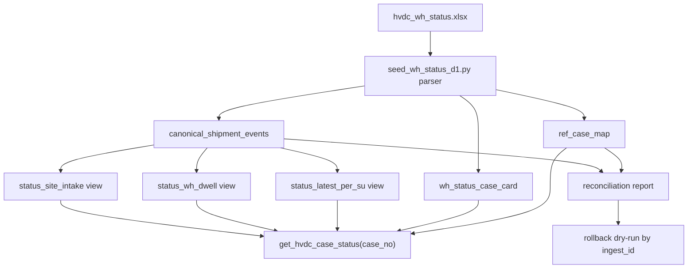

# HVDC Case-Based Warehouse/Event SSOT Plan

- date: 2026-05-25
- scope: Case No. based warehouse/site event SSOT, D1 canonical projection, reconciliation, rollback
- source context: `wh status/hvdc_wh_status.xlsx`, existing Cloudflare D1 `hvdc-mcp-audit`, current `get_hvdc_case_status(case_no)` MCP path

## Phase 1: Business Review

### 1.1 문제 정의

현재는 `hvdc_wh_status.xlsx`를 Case No. 기준으로 D1에 projection하고 `get_hvdc_case_status(case_no)`로 조회할 수 있다.
목표는 Case No.를 유일하고 불변인 SSOT 축으로 고정하고, 창고/현장 날짜 컬럼을 표준 이벤트 타임라인으로 정규화해 status view, dwell KPI, 대사, rollback까지 가능한 운영 모델로 확장하는 것이다.

정량 영향 범위:

- source workbook rows: 10,095 rows
- unique Case No. projection: 7,564 cases
- WH date-bearing cases observed: 4,881 cases
- current D1 case cards: 7,564 rows
- current event table impact: `milestone_event`, `shipment_unit`, `identifier_index`, `wh_status_case_card`

### 1.2 제안 옵션

| 옵션 | 설명 | 공수(일) | 리스크 | 비용(AED) |
|------|------|---------:|--------|----------:|
| A | 최소 확장. 현재 D1 구조 위에 `case_map`, `public_shipments` 성격의 이벤트 테이블만 추가하고 `get_hvdc_case_status`에서 읽는다. | 1.5 | 낮음. 기존 MCP 호환성 유지. | 0 |
| B | 권장 확장. A + `status_latest_per_su`, `status_wh_dwell`, `status_site_intake` view + reconciliation report + dry-run rollback까지 포함한다. | 3 | 중간. 새 view와 대사 기준이 추가된다. | 0 |
| C | 풀 SSOT. B + TTL/RDF sync, SPARQL triple count 대사, rollback TTL delete plan까지 포함한다. | 5 | 높음. RDF와 D1 양방향 정합성 리스크가 크다. | 0 |

### 1.3 추천 & 근거

추천은 옵션 B다.
현재 D1/MCP projection은 이미 운영되고 있으므로, 별도 대형 재작성보다 canonical event table과 status view를 추가하는 방식이 안전하다.
옵션 B는 창고 체류일, 현장 입고, 대사, rollback이라는 운영 요구를 충족하면서 TTL/RDF 변경은 다음 단계로 격리한다.

실패 시 롤백 전략: `ingest_id` 기준으로 신규 이벤트/뷰 projection만 삭제하고 기존 `shipment_unit`, `milestone_event`, `wh_status_case_card`는 보존한다.

### 1.4 승인 요청

[ ] Phase 1 승인

승인 전에는 Phase 2 Engineering Review와 구현을 진행하지 않는다.

## Coordinator Input Packet

### objective

Case No.를 stable SSOT key로 확정하고, `hvdc_wh_status.xlsx`의 날짜/장소 컬럼을 canonical D1 event timeline으로 투영해 warehouse dwell, site intake, latest status, reconciliation, rollback을 지원한다.

### non-negotiables

- `Case No.`는 중복 ShipmentUnit 생성을 막는 stable key여야 한다.
- 원본 Excel 값이 비어 있으면 값을 추정하지 않는다.
- `case_norm`과 `case_raw` 왕복 매핑을 유지한다.
- 각 파생 이벤트는 `source_file`, `source_row`, `ingest_id`로 원본 추적 가능해야 한다.
- rollback은 dry-run report 없이는 실행하지 않는다.
- 기존 `get_hvdc_case_status(case_no)` 응답 호환성을 깨지 않는다.

### acceptance criteria

- `ref_case_map` equivalent table has one row per normalized Case No.
- `canonical_shipment_events` equivalent table stores WH/SITE/VESSEL/CUSTOMS events with source trace.
- `WH_RECEIPT`, `WH_ISSUE`, `SITE_RECEIPT`, `M100_FINAL_DELIVERED` event types are generated from the workbook.
- `status_latest_per_su` returns latest event per ShipmentUnit.
- `status_wh_dwell` calculates WH dwell days for cases with both WH receipt and WH issue.
- `status_site_intake` exposes final site receipt dates.
- reconciliation report compares raw rows, case map count, event count, and latest dates.
- rollback dry-run lists affected rows by `ingest_id` before delete.

### option set

- A: Current schema compatible minimal event table.
- B: Canonical event table plus status views and reconciliation.
- C: Full D1 plus TTL/RDF sync and SPARQL reconciliation.

### required evidence

- Excel parser row count and unique Case No. count.
- D1 row counts by table after seed.
- Sample Case No. with WH receipt/issue and site receipt.
- Sample Case No. without WH date proving null preservation.
- Reconciliation report path and one-line PASS/WARN/FAIL status.
- Rollback dry-run report path.

### test expectations

- Unit test for case normalization: `207721.0`, `207721`, whitespace, hyphen variants.
- Unit test for event generation from non-null WH/SITE date columns.
- Integration test for `get_hvdc_case_status(case_no)` returning `caseCard`, `warehouseDates`, and canonical events.
- D1 seed health check with thresholds for case map, event rows, status views, and audit rows.
- Smoke test against deployed `/mcp` for a WH-bearing case such as `207721`.

## Phase 2: Engineering Review

### 2.1 Mermaid 다이어그램

### 2.2 파일 변경 목록

| 파일 | 변경 유형 | 설명 |
|------|----------|------|
| `migrations/0007_case_event_ssot.sql` | create | `ref_case_map`, `canonical_shipment_events`, `ingest_audit`, `row_index`, status views 생성 |
| `scripts/seed_wh_status_d1.py` | modify | Case map, canonical event, ingest audit, row index 생성 추가 |
| `scripts/reconcile_wh_status_d1.py` | create | raw workbook, D1 projection, latest status, event continuity 대사 보고서 생성 |
| `scripts/rollback_wh_status_ingest.py` | create | `ingest_id` 기준 dry-run/execute rollback 지원 |
| `scripts/verify-seed.ts` | modify | case map/event/status view/audit row count 검증 추가 |
| `server/src/hvdc-server.ts` | modify | `ControlTowerShipmentReport`에 canonical events/status summary 선택 필드 추가 |
| `server/src/worker.ts` | modify | D1 lookup에서 canonical event/status view를 읽어 report에 포함 |
| `tests/control-tower-d1.test.ts` | modify | case card + warehouse dates + canonical events + dwell summary fixture 검증 |
| `tests/case-event-ssot.test.ts` | create | case normalization, event generation, rollback dry-run 단위 테스트 |

### 2.3 의존성 & 순서

1. DDL migration을 먼저 추가한다.
2. Excel seed script가 새 테이블을 채우도록 확장한다.
3. reconciliation script를 추가해 seed 결과를 검증한다.
4. rollback script를 dry-run 우선으로 추가한다.
5. Worker report는 기존 응답 호환성을 유지하면서 선택 필드를 추가한다.
6. 테스트를 추가한 뒤 D1 remote migration/seed/reconcile 순서로 실행한다.
7. 마지막에 Cloudflare deploy와 `/mcp get_hvdc_case_status` smoke를 실행한다.

병렬 가능 작업:

- DDL 작성과 테스트 fixture 설계는 병렬 가능하다.
- reconciliation script와 rollback script는 `ingest_id` contract가 확정된 뒤 병렬 가능하다.
- Worker report patch는 D1 view 이름이 확정된 뒤 진행한다.

공유 모듈:

- `scripts/seed_wh_status_d1.py`는 기존 운영 seed 경로다. 변경 전후 row count와 `get_hvdc_case_status` smoke가 필수다.
- `server/src/worker.ts`는 배포 runtime이다. 선택 필드 추가만 허용하고 기존 필드 삭제는 금지한다.

### 2.4 테스트 전략

단위 테스트:

- `normalize_case`: `207721.0`, `207721`, 공백, 하이픈, 대소문자 variant를 같은 key로 만든다.
- event generator: WH date column이 non-null이면 `WH_RECEIPT` 이벤트를 만든다.
- event generator: `first in wh`와 `last out wh`가 있으면 `WH_RECEIPT`, `WH_ISSUE`를 만든다.
- rollback dry-run: `ingest_id`로 삭제 대상 row count만 보고하고 실제 삭제하지 않는다.

통합 테스트:

- `get_hvdc_case_status(207721)`은 `caseCard`, `warehouseDates`, canonical WH/SITE events를 반환한다.
- WH 날짜가 없는 `279655`은 `warehouseDates=null` 계열을 유지하고 추정값을 만들지 않는다.
- `verify:seed`는 `ref_case_map`, `canonical_shipment_events`, `wh_status_case_card`, status views count를 검증한다.

회귀 테스트:

- `tests/control-tower-d1.test.ts`
- `tests/descriptor.test.ts`
- `npm run typecheck`
- `npm run verify:seed`
- 필요 시 `npm run verify`

### 2.5 리스크 & 완화

| 리스크 | 영향 | 완화 |
|--------|------|------|
| Case No. normalization이 기존 `WHCASE-*`와 충돌 | 기존 조회 실패 가능 | 기존 `identifier_index`와 병행하고 migration 전후 sample smoke 수행 |
| canonical event table이 기존 milestone_event와 의미 중복 | 운영자가 다른 날짜를 볼 수 있음 | `event_type`과 `milestone_code`를 분리하고 report에서 source를 표시 |
| D1 remote seed가 대량 row write로 느려짐 | 배포/seed 시간 증가 | chunked SQL 유지, dry-run count 선행 |
| rollback script 오작동 | 운영 데이터 삭제 위험 | 기본 mode는 dry-run, execute에는 명시 flag와 ingest_id 필수 |
| ChatGPT가 새 필드를 렌더링하지 않음 | 화면 누락 가능 | `caseCard`처럼 구조화 배열로 제공하고 prompt에서 표 표시 유도 |

## Phase 2 승인 요청

[ ] Phase 2 승인

승인하면 위 파일 변경 목록 기준으로 DDL → seed → reconcile/rollback → Worker report → tests → deploy 순서로 구현한다.
