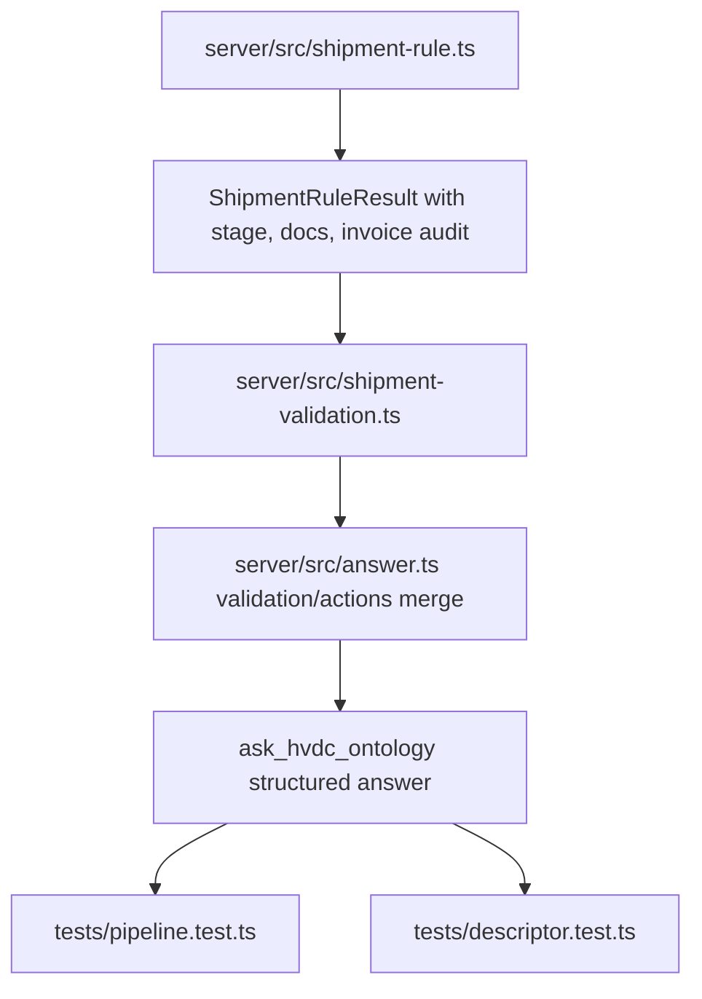
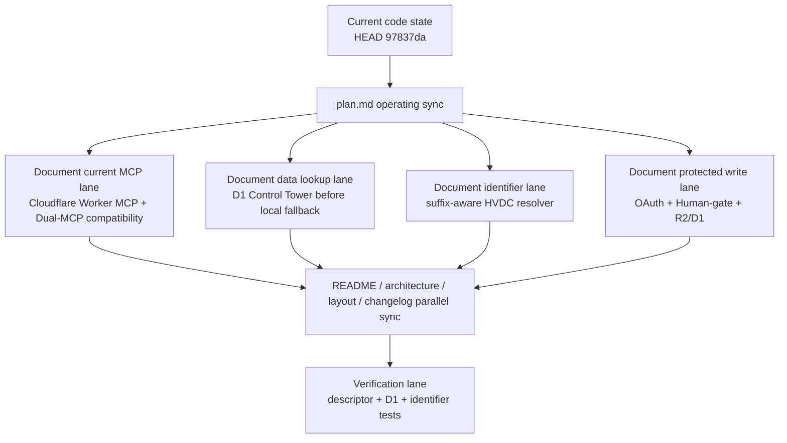

# Plan: Phase 2 Validation Signal Merge

Created: 2026-05-11
Status: Approved for implementation by follow-up instruction
Scope: SCT_ONTOLOGY `ask_hvdc_ontology` validation signal merge after Phase 1 `shipmentRule` adapter

## Phase 1: Business Review

### 1.1 Problem Definition

현재 상태: `ask_hvdc_ontology`는 `shipmentRule` 보조 객체를 반환하지만, 그 안의 deterministic risk가 `validation`, `actions`, `validationStatus`, human/finance gate로 아직 병합되지 않는다.

목표 상태: matched sample shipment의 stage, missing documents, AGI/DAS M130 risk, invoice audit, exposure, human gate를 validation signal과 action guidance로 병합하되 corpus evidence ID를 만들지 않는다.

정량 영향 범위:

- Runtime files likely touched: 4 files
  - `server/src/shipment-rule.ts`
  - `server/src/types.ts`
  - `server/src/answer.ts`
  - `server/src/index.ts`
- Test files likely touched: 2 files
  - `tests/pipeline.test.ts`
  - `tests/descriptor.test.ts`
- Required v1 requirements covered: 4
  - `VAL-01`
  - `VAL-02`
  - `VAL-03`
  - `VAL-04`
- Existing verification gate: `npm run verify`
- Expected focused test growth: 4-6 tests

### 1.2 Proposed Options

| Option | Description | Effort (days) | Risk | Cost (AED) |
|---|---|---:|---|---:|
| A | Keep `shipmentRule` as the source of truth and derive validation findings/actions in `answer.ts` only. | 1 | Low blast radius, but `answer.ts` gains merge logic. | 0 |
| B | Add a dedicated mapper module, for example `server/src/shipment-validation.ts`, that converts `ShipmentRuleResult` into `ValidationFinding[]` and `ActionRecommendation[]`. | 1.5 | Slightly more files, cleaner testing and lower future coupling. | 0 |
| C | Expand `shipment-rule.ts` so it directly returns both `shipmentRule` and prebuilt validation/action signals. | 1 | Fast, but mixes rule evaluation with answer-layer policy and may blur corpus-vs-rule boundaries. | 0 |

### 1.3 Recommendation & Rationale

Recommended option: B.

Reason 1: It keeps sample rule evaluation separate from answer-level validation policy.
Reason 2: It gives Phase 2 a testable merge unit without making `answer.ts` absorb too much business logic.
Reason 3: It reduces the risk that rule-only output becomes fake corpus evidence.

Rollback strategy: Revert the mapper import and remove the optional Phase 2 validation/action additions while keeping Phase 1 `shipmentRule` intact.

### 1.4 Approval Request

- [x] Phase 1 승인

Approval basis: follow-up instruction requested implementation from this document.

## Phase 2: Engineering Review

### 2.1 Mermaid Diagram



### 2.2 File Change List

| File | Change Type | Description |
|---|---|---|
| `server/src/shipment-rule.ts` | modify | Extend matched result with current stage, routing pattern, missing documents, invoice audit, invoice exposure, and open exceptions. |
| `server/src/types.ts` | modify | Extend `ReasonCode` and `ShipmentRuleResult` for Phase 2 validation merge fields. |
| `server/src/shipment-validation.ts` | create | Convert `ShipmentRuleResult` into `ValidationFinding[]` and `ActionRecommendation[]` without corpus evidence IDs. |
| `server/src/answer.ts` | modify | Merge shipment validation findings/actions after normal grounding validation and before verdict/action assembly. |
| `server/src/index.ts` | modify | Extend zod `shipmentRule` schema with Phase 2 fields. |
| `tests/pipeline.test.ts` | modify | Add pipeline and mapper tests for VAL-01 through VAL-04. |
| `tests/descriptor.test.ts` | modify | Keep data-only schema/metadata regression check. |

Create-file collision check:

- `server/src/shipment-validation.ts` does not exist at planning time.
- If it exists during execution, do not overwrite blindly; inspect and patch the existing file.

### 2.3 Dependencies & Order

1. TDD RED: add failing tests for `VAL-01` through `VAL-04`.
2. Shared contract first: extend `ShipmentRuleResult` and `ReasonCode`.
3. Rule result enrichment: expose stage, missing documents, invoice audit, exposure.
4. Mapper module: create `server/src/shipment-validation.ts`.
5. Answer merge: append mapper findings/actions before deriving final verdict and building evidence trace.
6. Schema parity: extend `server/src/index.ts`.
7. Verification: focused tests, then `npm run verify`.

Parallel paths:

- Path A: mapper unit behavior and result enrichment can be designed from `shipment-rule.ts`.
- Path B: descriptor/data-only regression can be verified independently.
- Merge point: `answer.ts` final verdict/action assembly.

Shared modules:

- `server/src/types.ts` is shared and must be changed before mapper and schema are final.
- `server/src/answer.ts` is the integration point and should be patched after mapper contract is stable.

### 2.4 Test Strategy

Unit tests:

- `evaluateShipmentRule()` returns `currentStage`, `missingDocuments`, `invoiceAudit`, `invoiceExposureAed`, and `humanGateRequired` for `SHP-0002`.
- `mergeShipmentValidation()` returns BLOCK findings for AGI/DAS M130 missing M115/M116/M117.
- `mergeShipmentValidation()` returns invoice human/finance gate action for exposure above `100,000.00 AED`.

Integration tests:

- `ask("BL-AUH-002 ...")` returns `verdict === "BLOCK"` due to shipment validation merge.
- `validation` includes shipment-rule findings with `evidenceIds: []`.
- `actions` includes human/finance gate guidance.
- `evidenceIds` still equals corpus evidence IDs only.

Regression tests likely to break:

- Existing AGI/DAS M130 corpus validation tests.
- Existing evidence trace tests if action text changes.
- Descriptor tests if `shipmentRule` schema changes.

### 2.5 Risks & Mitigations

| Risk Area | Risk | Mitigation |
|---|---|---|
| Compatibility | New `ShipmentRuleResult` fields may break schema parity. | Make fields optional where compatible and update zod schema. |
| Evidence safety | Rule findings may look corpus-supported. | Use `evidenceIds: []` for rule-only findings and test this explicitly. |
| Security/privacy | Raw identifiers may bypass masking. | Continue passing masked question text only. |
| Business workflow | Invoice or AGI/DAS gate may over-block generic answers. | Trigger merge only on matched shipment rule result; not-found and unavailable remain non-breaking. |
| Maintainability | `answer.ts` may become too policy-heavy. | Use dedicated mapper module. |

## Coordinator Input Packet

objective:

- Merge deterministic `shipmentRule` risk data into validation findings, action recommendations, and human/finance gate context for `ask_hvdc_ontology`.

non-negotiables:

- Corpus evidence remains the only source for `evidence[]`, `evidenceIds`, and `evidenceTrace.evidenceIds`.
- Rule-only findings may add `validation` and `actions`, but must cite no fake corpus evidence IDs.
- `ask_hvdc_ontology` remains data-only.
- No new standalone MCP tool is added in v1.
- AGI/DAS M130 missing M115/M116/M117 must become BLOCK validation.
- Invoice BLOCK/CRITICAL, missing evidence, rate mismatch, zero standard, or exposure above `100,000.00 AED` must require human or finance gate.

acceptance criteria:

- `VAL-01`: Matched shipments expose current stage, missing documents, risks, invoice audit, invoice exposure, and human gate status.
- `VAL-02`: AGI/DAS at M130 with missing M115/M116/M117 adds a BLOCK validation signal.
- `VAL-03`: invoice high-risk or exposure over `100,000.00 AED` adds human/finance gate action guidance.
- `VAL-04`: rule validation adds warnings, blocks, or actions without creating fake evidence IDs.
- `npm test -- tests/pipeline.test.ts tests/descriptor.test.ts` passes.
- `npm run verify` passes.

option set:

- A: derive merge in `answer.ts`.
- B: create mapper module and wire it in `answer.ts`.
- C: expand `shipment-rule.ts` to return merged signals.

required evidence:

- Diff showing no mutation of `evidence[]`, `evidenceIds`, or `evidenceTrace.evidenceIds`.
- Tests proving AGI/DAS BLOCK appears from shipment rule risk.
- Tests proving invoice human/finance gate appears from shipment rule risk.
- Tests proving ask descriptor remains data-only.
- Full `npm run verify` output.

test expectations:

- Unit tests for mapper behavior if Option B is approved.
- Pipeline tests for `BL-AUH-002` / `PKG-AGI-02` matched shipment validation merge.
- Regression tests for not-found INFO and unavailable WARN not breaking normal answers.
- Descriptor test confirming no UI metadata is added to `ask_hvdc_ontology`.

coordination recommendation:

- Use `pipeline-coordinator` if all three options remain open after approval, because Option A/B/C affect shared answer-policy boundaries.

## 2026-05-14 Plan Update: Operating Documentation Sync

Purpose: keep the root PLAN aligned with the current code and operating evidence while preserving the earlier Phase 2 Validation Signal Merge plan above.

Current baseline:

- Repository: `C:\Users\jichu\Downloads\HVDC Ontology Grounded`
- Local HEAD and `origin/main` HEAD: `97837da9af12a32a62e4e8ef19373f64674ecc53`
- Scope of this update: planning documentation only; implementation code is already present in the current tree.

### Done

- Cloudflare MCP operation is now the active operating lane. The server exposes the Cloudflare Worker MCP entrypoint and keeps the remote MCP endpoint as the deployment-facing path.
- The MCP tool surface is documented as a 15-tool operating set through `server/src/hvdc-server.ts` and descriptor tests.
- `resolve_any_key` now covers the D1 Control Tower lookup path before local fallback resolution. This makes shipment-unit lookup available from the Cloudflare D1 dataset when bindings are present.
- The HVDC code resolver is suffix-aware. It preserves split-shipment suffixes such as `HE68-1`, `SIM5-2A`, and `SEI17-03` and normalizes them into full `HVDC-ADOPT-*` codes.
- R2/D1 protected upload and write operations are part of the operating plan. Upload URL creation, upload completion, file attachment, write proposal, and write commit remain guarded by OAuth Bearer scopes and Human-gate approval language.
- Dual-MCP engines remain in scope. The operating plan keeps the Cloudflare Worker MCP path and the local/Claude MCP compatibility path separated instead of treating them as one runtime.

### Remaining

- Root documentation sync still needs to stay coordinated with parallel edits in `README.md`, `SYSTEM_ARCHITECTURE.md`, `LAYOUT.md`, and `CHANGELOG.md`. This `plan.md` section records the operating plan, but those other files are owned by separate agents in this work cycle.
- Production-like verification depends on Cloudflare bindings. Local tests can confirm descriptors, resolver behavior, and mocked D1 lookup behavior, but live R2/D1 behavior still depends on the deployed Worker environment and configured bindings.
- The previous Phase 2 validation-signal plan remains preserved above. It should not be treated as deleted or replaced by this operating sync section.

### Verification

Current verification evidence to keep attached to this operating plan:

- Code evidence:
  - `server/src/identifier-normalizer.ts` defines suffix-aware identifier normalization and lookup variant expansion.
  - `server/src/worker.ts` wires Cloudflare D1 Control Tower lookup, R2/D1 storage operations, and Worker MCP handling.
  - `server/src/hvdc-server.ts` defines the MCP tool descriptors, `resolve_any_key`, protected upload/write tools, and Dual-MCP-compatible server registration.
- Test evidence:
  - `tests/control-tower-d1.test.ts` verifies D1 Control Tower lookup preference for `resolve_any_key` and D1 action queue routing behavior.
  - `tests/identifier-normalizer.test.ts` verifies suffix-aware HVDC code normalization for `HE68-1`, `SIM5-2A`, and `SEI17-03`.
  - `tests/descriptor.test.ts` verifies Cloudflare Worker MCP entrypoint behavior and OAuth-protected upload/write tool descriptors.
- ChatGPT operating smoke evidence:
  - `resolve_any_key` direct calls passed for `SIM5-2A`.
  - `resolve_any_key` direct calls passed for `HE68-1`.
  - `resolve_any_key` direct calls passed for `SEI17-03`.

### Operating documentation workflow



### Next execution lane

Run the documentation verification lane after all parallel documentation edits land:

```powershell
npm test -- tests/control-tower-d1.test.ts tests/identifier-normalizer.test.ts tests/descriptor.test.ts
```

Exit condition:

- The three focused tests pass.
- The documentation set consistently describes Cloudflare MCP 15 tools, D1 Control Tower lookup, suffix-aware HVDC code resolving, protected R2/D1 upload/write, and Dual-MCP operation.
