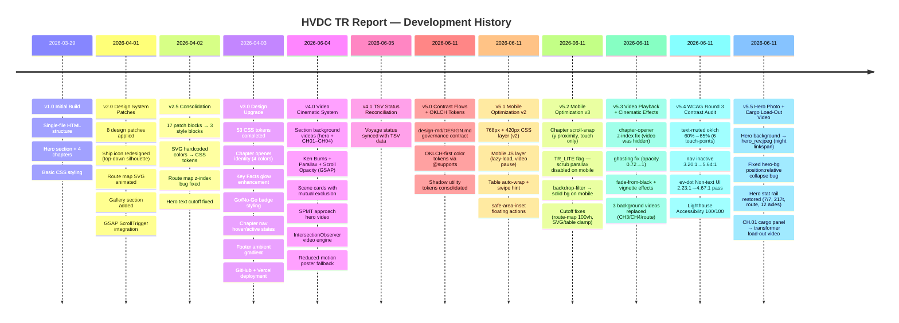

---
# Changelog

All notable changes to the HVDC TR Report are documented here.

---

## [v5.5] — 2026-06-11

### Changed
- **Hero background → `tr/hero_rev.jpeg`** (야간 부두 linkspan 컷): 기존 SPMT 배경영상(`hero-spmt-approach.mp4`) 대신 정적 사진 커버로 교체. `background-position: center top`으로 게이트리 상단 조명이 어느 화면 비율에서도 잘리지 않도록 고정.
- **Hero overlay 완화 + orbit `opacity 0.55→0.30`**: 사진이 표지로 선명하게 노출되도록 좌측 텍스트 보호 그라데이션 하향.
- **CH.01 Cargo Profile 이미지 패널 → load-out 영상**: 정적 WhatsApp 이미지를 실제 765kV 변압기 12-axle SPMT 적재 영상(`assets/video/cargo-loadout.mp4`)으로 교체. 본문이 설명하는 작업을 영상이 직접 시연.

### Added
- **Hero stat rail 복원**: `7/7 Units · 217.0 t · MZP → AGI · 12 Axle Lines`, GSAP count-up + `prefers-reduced-motion` 폴백.
- 신규 에셋: `tr/hero_rev.jpeg`, `assets/video/cargo-loadout.mp4` (오디오 제거·재인코딩 4.7MB→2.4MB), `tr/cargo-loadout-poster.jpg`.

### Fixed
- **Hero 배경 사진 미표시 버그**: `#hero > *` 규칙이 `.hero-bg`의 `position:absolute`를 `relative`로 덮어써 박스가 0px로 붕괴 → 배경영상만 보이던 문제. `.hero-bg / .hero-overlay`를 `absolute; inset:0`로 강제 복원, 경쟁 비디오 `display:none`.

> 변경 파일: `index.html` (hero markup + CSS + CH.01 panel), 신규 에셋 3종. 이전 모든 버전 보존.

---

## [v5.4] — 2026-06-11

### Changed
- **WCAG Round 3 — 4 contrast patches** (oklch canvas 실측 기반 확정 수치):
  - `--text-muted` token `oklch(60%) → oklch(65%)`, hex fallback `#8890aa → #848fa7`; `var(--text-muted)` 전 구독자(key-fact-label, ev-col-code, footer-desc 등) 자동 상향
  - `.ev-col-code { color: oklch(65% 0.038 265) }` explicit override 추가 (design-upgrade-v3 block)
  - `.chapter-nav-link` inactive `rgba(255,255,255,0.35→0.52)` → **3.20:1 → 5.64:1**; hover `rgba(255,255,255,0.65→0.78)` → **5.95:1 → 11.56:1**
  - `.ev-dot` base background `oklch(72% 0.118 82) → oklch(50% 0.118 82)` — Non-text UI **2.23:1 → 4.67:1** (3:1 threshold pass)

### Fixed
- **Lighthouse Accessibility 98 → 100**: `<main id="content">` landmark 추가 (`landmark-one-main` 감사 pass)

> 변경 파일: `index.html` 6곳 (L90, L154, L2574, L2586, design-upgrade-v3 block +2줄). 이전 모든 버전 보존.

---

## [v5.3] — 2026-06-11

### Fixed
- **배경 영상 재생 불가 (근본 원인)**: `.chapter-opener .section-video-wrap` z-index `0 → 1`. 동일 z-index의 불투명 정적 포스터 `.chapter-opener-bg`(DOM 후순위)가 비디오를 덮고 있었음. hero(`#hero .hero-bg { z-index:-1 }`)는 이미 수정됐으나 챕터 오프너에 누락
- **고스팅 (이중 이미지)**: 챕터 비디오 `opacity 0.72 → 1`, `brightness 0.75 → 0.62` (아래 정적 포스터 비침 제거)

### Added
- **시네마틱 스크롤 효과** (`initCinematicEffects` 확장): fade-from-black 등장(`.video-reveal`), center-weighted vignette(`.video-vignette`). 오버레이는 JS 동적 생성(섹션 HTML 무수정). `TR_LITE`(모바일)·`prefers-reduced-motion` 가드 모두 보존
- **`.vercelignore`**: bak·로컬·소스 파일 배포 제외

### Changed
- **Parallax + Ken Burns 강화**: scale `1.05 → 1.06`, y `±15 → ±20`, scrub `1.5 → 1.2`
- **배경 영상 3건 교체** (H.264 8-bit + faststart, 포스터 갱신, 캐시버스터 `?v=2`): CH.03 TIDES, CH.04 PERFORMANCE, CH.02B ROUTE
- **음성 데이터 TR1–TR7 최종 반영** (authoritative voyageData):
  - 음성 카드 7장 status/date/metric/incident/note 원문 갱신 — **TR6 AMBER→Completed**, **TR7 HTML-only gap→AGI Offload Complete / Return Open**
  - GNGO: TR6/TR7 GO 행 추가(TR2 fog·TR3 weather NO-GO 이력 유지), 시스템 상태 라인·Trips `5/6→7/7` 갱신
  - 카운터 정합: "TR1–TR4/TR6" → "TR1–TR7" (KPI scope·route-map stat·chapter-desc)

> v5.1–v5.2(모바일 최적화)·v5.0(contrast flows) 전부 보존. 이 릴리스는 그 위에 영상 재생 수정 + TR1–TR7 음성 데이터만 surgical 재적용.

---

## [v5.2] — 2026-06-11

### Added
- **`<style id="mobile-optimize-v3-20260611">`** — scroll-snap + performance + cutoff layer:
  - `@media (max-width: 768px) and (hover: none) and (pointer: coarse)`: `html { scroll-snap-type: y proximity }` with `scroll-snap-align: start` on `#hero`, `.chapter-opener`, `#route-map-hero` — swipes near chapter boundaries settle on the opener, free scroll elsewhere; gated so desktop Lenis never sees CSS snap
  - `@media (max-width: 768px)` performance: `backdrop-filter: none` + near-opaque solid background on glass surfaces (`.glass-card`, `.scene-card`, `.decision-card`, `.rmap-phase-card`, `.data-point`, `.rmap-glass-strip`, `#chapter-nav`, floating buttons), film-grain `animation: none` on `.chapter-opener::after`, `will-change: auto` on parallax targets, `#chapter-4 { clip-path: none }` safety net
  - Cutoff fixes: `.route-map-hero-section { min-height: auto }` (was 100vh), `.rmap-svg-container > svg { min-width: clamp(480px, 140vw, 640px) }`, `.rmap-glass-strip` pinned via `position: sticky; left: 0` inside the horizontal scroller, tables `min-width: clamp(560px, 160vw, 680px)` (≤420px: `clamp(520px, 155vw, 620px)`), evidence wall → 1 column ≤480px, hero `min(640px, 100svh)` + reduced padding ≤420px
- **`<script id="mobile-optimize-v3-js">`** — late `ScrollTrigger.refresh()` after `load` (lazy images / v3 height changes) and debounced refresh on `orientationchange`
- **`TR_LITE` flag** (`max-width: 768px` or coarse pointer) + `ScrollTrigger.config({ ignoreMobileResize: true })` after GSAP plugin registration
- `viewport-fit=cover` on the viewport meta tag

### Changed
- Scrub/continuous animations now registered only when `!TR_LITE`: hero parallax, chapter-opener bg parallax + text scrub-out, chapter-header bg parallax, full-bleed parallax, Ch3→Ch4 clip-path wipe, orbit-sphere canvas rAF loop, glass-card blur-in, opener clip wipe, video Ken Burns scrub. Once-only reveals (count-ups, card stagger, text entrances) kept on mobile
- Chapter nav IntersectionObserver now also tracks `route-map-hero` (CH.02B link highlights)

### Fixed
- **Chapter 4 invisible on mobile**: `initClipPathTransition` set `clip-path: inset(0 100% 0 0)` unconditionally; the scrub wipe could leave it clipped — now skipped on mobile with a CSS safety net
- **Hidden CPU drain**: orbit-sphere canvas rAF loop (~880 trig ops/frame) kept running behind `display: none` on mobile
- **Duplicate scroll handler**: redundant `scroll → ScrollTrigger.update()` listener removed on touch devices (ScrollTrigger installs its own rAF-batched listener)

---

## [v5.1] — 2026-06-11 (PR #9)

### Added
- **`<style id="mobile-optimize-v2-20260611">`** — upgraded mobile CSS layer:
  - `@media (max-width: 768px)`: `overflow-x: clip` on all sections, `#chapter-nav` 52px with `overscroll-behavior-x: contain`, hero `min-height: 100svh`, cards → 1 column, voyage-card stacked, `table-scroll-wrap` swipe hint + sticky first column, `floating-actions` grid with `env(safe-area-inset-*)`, videos `display: none` (GPU relief), `backdrop-filter: blur(10px)`
  - `@media (max-width: 420px)`: hero-meta 1 column, `key-fact-num` smaller, table `min-width: 620px`
  - Combined `prefers-reduced-motion + (max-width: 768px)`: `transition-duration: 0.01ms`, animations disabled
- **`<script id="mobile-optimize-v2-js">`** — first dedicated mobile JS optimization layer:
  - `optimizeImages()`: `decoding="async"` on all images, `loading="lazy"` on non-hero images
  - `optimizeVideos()`: pause + `preload="none"` on mobile
  - `improveTables()`: auto-wraps unwrapped tables in `.table-scroll-wrap`
  - `centerActiveChapterLink()`: `scrollIntoView(inline: center)` on active chapter nav link
  - `matchMedia` `addEventListener` / `addListener` fallback for older Safari
  - `orientationchange` re-centers active nav link after 250ms

### Changed
- `#chapter-nav` mobile height: 48px (v1) → 52px (v2)
- `.table-scroll-wrap > table` min-width: 760px (v1) → 680px (v2)
- `.section-bg-video` on mobile: `opacity: 0.32` (v1) → `display: none` (v2, stops GPU paint)

---

## [v5.0] — 2026-06-11 (PR #8)

### Added
- **`design-md/DESIGN.md`** — Contrast Flows governance contract:
  - 6-layer flow order table (Background → Section → Evidence → Text → Accent → Signal)
  - OKLCH rules, Taste Skill adaptation, anti-patterns, test-first checklist
  - Full token map with OKLCH ↔ hex cross-reference for all 19 color tokens
  - Canvas color notes (`heroOrbitCanvas`, `optimus-sphere-canvas`) documenting remaining work
- **`@supports (color: oklch(0 0 0))` override block** in `index.html `:root``:
  - 19 color tokens migrated to OKLCH-first (Flow 1–2 backgrounds, Flow 4 text, Flow 5 gold, Flow 6 cyan/indigo, status signals)
  - Hex values retained in base `:root` as browser fallbacks

### Changed
- `:root` token comments updated to flow-role labels (Flow 1–2 / 4 / 5 / 6)
- `--shadow-glow-gold` / `--shadow-glow-cyan` consolidated into primary `:root` block; duplicate declarations in secondary blocks removed

---

## [v4.1] — 2026-06-05

### Changed
- **TSV Status Reconciliation**: voyage completion status and operational data synced with latest TSV source records

---

## [v4.0] — 2026-06-04 (PRs #5–#7)

### Added
- **Section background videos**: `hero-spmt-approach.mp4`, `route-corridor.mp4`, `chapter1-cargo.mp4`, `chapter2-docs.mp4`, `chapter3-tides.mp4`, `chapter4-performance.mp4`
- **`section-video-wrap` pattern**: wrapper div with `--video-poster` CSS variable, `::before` poster layer, z-index stack (wrap → video → overlay → content)
- **Cinematic effects** (`initCinematicEffects()`): Ken Burns scale 1.0→1.06, Parallax translateY 20→-20px, `video.currentTime` scrub via GSAP ScrollTrigger
- **Scene cards** (Mission / Corridor / Go-No-Go): mutual exclusion via GSAP `onEnter`/`onLeave`, fixed mobile stacking
- **`initSectionVideoPlayback()`**: IntersectionObserver + `canplay` event engine; videos pause on section exit, resume on re-entry
- **Corporate Enterprise autoplay fallback**: user-gesture listener (`scroll`/`click`/`touch`/`keydown`) to satisfy Chrome Enterprise policy

### Changed
- Hero video: `hero-transformer.mp4` → `hero-spmt-approach.mp4` (Grok-generated SPMT approach footage)
- Hero overlay gradient strengthened (0.96/0.54/0.92) for readability with brighter footage
- `preload="metadata"` on all videos (bandwidth-safe default); `preload="auto"` fallback for corporate networks
- Video playback engine rewritten: removed ScrollTrigger dependency, `visibilitychange` / `focus` / `pageshow` re-play handlers

### Fixed
- Videos not playing on initial load (section already in viewport)
- Reduced-motion: poster JPEG shown instead of black background
- Route poster extracted from `route-corridor.mp4` via ffmpeg

---

## [v3.0] — 2026-04-03

### Added
- **Design tokens completed**: Shadow scale (`--shadow-sm` → `--shadow-xl`, `--shadow-glow-gold/cyan`), Radius scale (`--radius-sm` → `--radius-full`), Motion scale (`--dur-fast` → `--dur-slow`, `--ease-bounce/smooth`), Z-index scale (`--z-base` → `--z-max`)
- **Chapter Opener identity**: Per-chapter color tints (Ch1: gold, Ch2: cyan, Ch3: indigo, Ch4: emerald) via CSS custom property `--chap-tint`
- **Key Facts section**: Ambient radial gradient background, tabular-nums, gold text-shadow glow with hover enhancement
- **Go/No-Go badges**: `.gngo-verdict.go` (green), `.gngo-verdict.nogo` (red), row hover interaction, date column accent
- **Chapter Nav states**: hover (gold-lt color transition), active (glow box-shadow)
- **Footer finishing**: Top fade-in gradient, ambient gold radial, brand opacity hover
- **GitHub repository**: `https://github.com/macho715/tr_report.git`
- **Vercel deployment**: Static hosting
- **Documentation**: README, LAYOUT, ARCHITECTURE, CHANGELOG (all with Mermaid diagrams)

### Changed
- Hero orbit sphere: 80% of 150% scale (`clamp(456px, 50vw, 672px)`)
- Orbit position: `bottom: 18%` (lifted from `5%`)
- Image assets: Compressed to JPEG q=80, max 1920px (57MB → 8MB, 84.6% reduction)

### Folder Organization
- `tr 문서/` reorganized: 9 new subfolders (`video/`, `docs/`, `web/`, `scripts/`, `data/`, `captures/`, `markdown/`, `contacts/`, `archive/`)
- 221 files moved from root to categorized folders

---

## [v2.5] — 2026-04-02

### Added
- `<style id="ds-tokens">` — 53 CSS custom properties
- `<style id="ds-components">` — all component selectors
- `<style id="ds-overrides">` — responsive + hero lift

### Changed
- Consolidated 17 patch `<style>` blocks → 3 named blocks
- SVG inline colors: 16 hardcoded hex values → `var(--accent-gold)`, `var(--accent-gold-lt)`

### Fixed
- **Route map disappeared** after consolidation: Added `position: relative; z-index: 2` to `.rmap-svg-container` to prevent `.rmap-bg-ocean` (absolute, z-index: 0) from covering the SVG
- **Hero text cutoff**: `#hero { padding-bottom: clamp(120px, 16vh, 180px) }` lifts content above viewport bottom

---

## [v2.0] — 2026-04-01

### Added
- GSAP 3.12.5 + ScrollTrigger + Lenis (all inlined)
- `initOrbitSphere()` — Unicode 3D rotating canvas on hero
- `initVoyageCards()` — clip-path wipe reveal on scroll
- `initKeyFactFloat()` — count-up number animation
- Route Map SVG with animated ship path (GSAP motionPath)
- 8 design patch style blocks

### Changed
- Ship icon: redesigned as top-down silhouette with hull, bridge, cargo hold, LCT label
- Chapter nav: sticky 78px with chapter indicator

### Fixed
- RACI table overflow on mobile
- Glass card stacking context

---

## [v1.0] — 2026-03-29

### Added
- Initial single-file HTML report
- 4 chapters: Cargo Specs, Voyage Log, Operations Analysis, Close-out
- Hero section with background image
- Chapter navigation
- Basic typography and color tokens
- Go/No-Go decision table
- Footer with attribution
